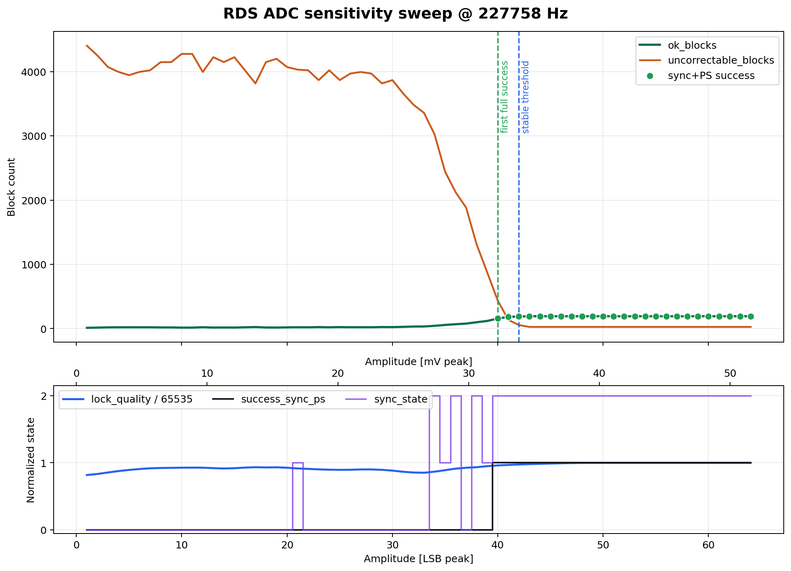
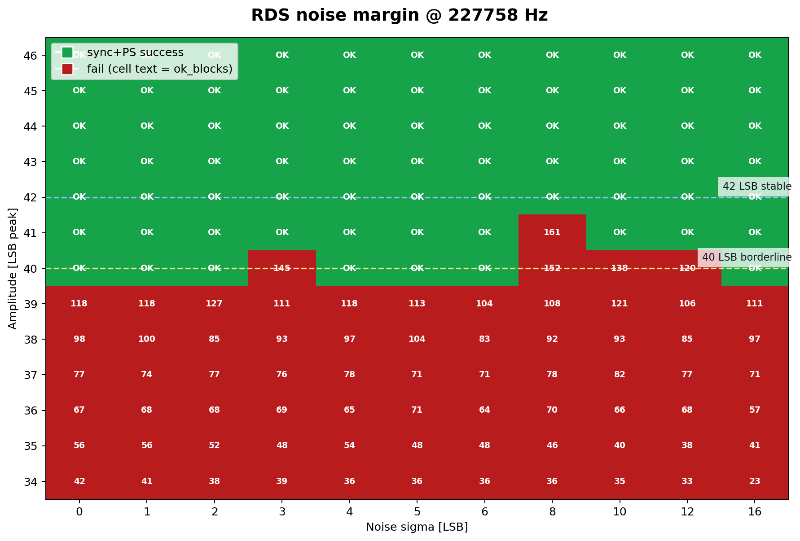

# RDS MPX Plan

## Cel

Ten dokument opisuje rzeczywisty stan implementacji odbioru i dekodowania RDS z sygnalu MPX
z TEA5767 na wolnym wejsciu ADC Flippera (`PA4`).

To nie jest juz "plan zyczeniowy". Celem tej wersji jest:
- opisac dokladnie aktualny kod,
- opisac rozjazdy miedzy starym planem a implementacja,
- pokazac co jest wziete koncepcyjnie z `SAA6588`,
- pokazac co w praktyce dziala, co jest jeszcze prowizoryczne, a co jest tylko zarezerwowane pod PCB v1.1.

Procesor docelowy: `STM32WB55RGV6TR` (`Cortex-M4`, DSP/FPU).

---

## Status implementacji i walidacji

Status kodu:
- `RDSAcquisition` jest zaimplementowany i stabilnie dostarcza probki ADC przez DMA.
- `RDSDsp` jest zaimplementowany i generuje strumien bitow DBPSK.
- `RDSCore` jest zaimplementowany i sklada bloki/grupy RDS oraz emituje zdarzenia.
- `radio.c` integruje dekoder z UI, zapisem runtime i opcjonalnym raw capture.

Status walidacji:
- Na sygnalach syntetycznych dekoder przechodzi testy i sklada poprawne `PI/PS/RT/PTY`.
- Na realnym sygnale z obecnego toru analogowego dekoder jest ograniczony glownie przez SNR,
  nie przez DMA/CPU.
- Pelna walidacja terenowa ma byc uznana za zakonczona dopiero po potwierdzeniu na PCB v1.1
  z torem `MCP6001`.

Najwazniejsze wnioski juz teraz:
- realny tor runtime pokazuje, ze `ADC + DMA + timer` sa stabilne,
- glowny problem to jakosc sygnalu MPX/RDS, nie wydajnosc cyfrowa,
- syntetyczny prog poprawnego dekodowania przy realnym sample rate `227758 Hz`
  wypada bardzo blisko przewidywanego zysku `MCP6001`.

---

## Warstwy systemu

Dekoder jest podzielony na 4 warstwy:

1. `RDSAcquisition`
   - odpowiada za `ADC + DMA + TIM1`,
   - dostarcza bloki `1024` probek `uint16_t`.

2. `RDSDsp`
   - usuwa DC,
   - miesza 57 kHz do bazy,
   - filtruje,
   - robi integracje symboli i decyzje DBPSK,
   - przekazuje bity do `RDSCore`.

3. `RDSCore`
   - szuka blokow RDS,
   - pilnuje synchronizacji,
   - poprawia wybrane burst errors,
   - sklada grupy `0` i `2`,
   - emituje zdarzenia do UI.

4. `radio.c`
   - wlacza/wylacza dekoder,
   - zapisuje `rds_runtime_meta.txt`,
   - wyswietla `PS` i stan sync,
   - obsluguje opcjonalny raw capture.

---

## Wybrany pin

Wejscie ADC:
- pin `4` Flippera
- `PA4 / ADC1_IN9`
- nazwa sygnalu na PCB: `RDS_MPX_ADC`

Powod wyboru:
- nie koliduje z `I2C` na `PC0/PC1`,
- nie koliduje z planowanymi liniami `PAM_MUTE`, `PAM_SHDN`, `PAM_MODE_ABD`,
- jest potwierdzonym kanalem ADC dla `STM32WB55`.

---

## Analog front-end (MCP6001)

### Cel sekcji

Wzmocnic skladowa RDS (`57 kHz`) z wyjscia `MPXO` TEA5767 przed podaniem na ADC `PA4`.

Bez wzmacniacza:
- sygnal RDS na MPXO jest bardzo maly,
- surowy ADC widzi tylko kilka-kilkanascie LSB,
- runtime z obecnej plytki potwierdza, ze cyfrowa czesc dekodera nie jest glownym limitem,
  tylko zbyt slaby sygnal analogowy.

Z `MCP6001`:
- tor ma odciac audio i pilota od strony analogowej,
- przesunac DC do srodka zakresu ADC,
- podniesc amplitude RDS do poziomu dajacego sensowny zapas dla DSP.

Pelna analiza analogowa i dobor elementow:
- [pcb_v1_1_design_notes.md](pcb_v1_1_design_notes.md)

### Parametry wyjscia MPXO z datasheetu TEA5767

- `VMPXO` DC: `680..950 mV`, typowo `815 mV`
- AC output (test mono): `60..90 mV`, typowo `75 mV`
- `Ro <= 500 Ohm`
- skladowa RDS na MPXO: okolo `6.7 mV peak`

### Obwod projektowy

Wzmacniacz nieodwracajacy `MCP6001` (SOT-23-5), zasilany z `3.3V_TEA`:

| Ref | Wartosc | Funkcja |
|---|---|---|
| `C1` | `1 uF` | coupling cap, zdejmuje DC z TEA |
| `C2` | `2.2 nF` | HPF cap |
| `R1` | `2.2 kOhm` | HPF shunt + sciezka bias |
| `Rb1` | `100 kOhm` | bias divider do `Vbias` |
| `Rb2` | `100 kOhm` | bias divider do `GND` |
| `Cb` | `100 nF` | AC ground dla `Vbias` |
| `Rf` | `10 kOhm` | feedback |
| `Rg` | `2 kOhm` | ustawienie gain |
| `C4` | `100 nF` | bypass VDD |

Kluczowe parametry obwodu:
- `HPF fc ~= 33 kHz`
- `Av = 1 + Rf/Rg = 6x`
- `Vbias = 1.65 V`
- spodziewany sygnal RDS po wzmacniaczu: okolo `41 LSB` na ADC (teoria)

### Schemat obwodu MCP6001


### Weryfikacja MCP6001

Potwierdzone z datasheetu i notatek projektowych:
- `GBW = 1 MHz`
- `Slew rate = 0.6 V/us`
- `rail-to-rail I/O`
- stabilna praca przy `G=+6`
- wejscie ADC Flippera nie przekracza problematycznego obciazenia pojemnosciowego

---

## Sygnal MPX

Sygnal MPX zawiera:
- `L+R` audio do okolo `15 kHz`
- pilot `19 kHz`
- `L-R` wokol `38 kHz`
- RDS na `57 kHz` (`3 x pilot`)

Wniosek praktyczny:
- tor analogowy i cyfrowy nie moga obcinac `57 kHz`,
- dlatego analogowy HPF usuwa glownie audio, a reszta selekcji jest robiona cyfrowo.

---

## Probkowanie ADC i RDSAcquisition

Pliki:
- `RDS/RDSAcquisition.h`
- `RDS/RDSAcquisition.c`

### Co robi RDSAcquisition?

`RDSAcquisition` to warstwa transportowa. Ona jeszcze niczego nie "rozumie" z RDS.

Jej zadanie jest proste:
1. ustawic ADC na `PA4`,
2. taktowac ADC z `TIM1`,
3. zapisywac probki do bufora DMA,
4. co `1024` probki oddac blok do dalszej obrobki.

Czyli: `RDSAcquisition` dba o to, zeby `RDSDsp` dostal ciagly, rowny strumien probek.

### Parametry faktycznie uzyte przez kod

Stale z kodu:
- `RDS_ACQ_TARGET_SAMPLE_RATE_HZ = 228000`
- `RDS_ACQ_DMA_BUFFER_SAMPLES = 2048`
- `RDS_ACQ_BLOCK_SAMPLES = 1024`
- `RDS_ACQ_TIMER_MS = 2`
- `RDS_ACQ_PENDING_LIMIT = 24`
- `RDS_ACQ_MAX_BLOCKS_PER_TICK = 3`

Rzeczywiste zachowanie:
- kod prosi o `228000 Hz`,
- `TIM1` przy `64 MHz` ustawia divider `281`,
- realny sample rate to `227758 Hz`, nie idealne `228000 Hz`.

To jest bardzo wazne, bo:
- aktualny firmware na Flipperze **nie** wpada w `fast path 228k`,
- na prawdziwym sprzecie dziala sciezka ogolna `NCO`,
- `fast path` istnieje, ale wlacza sie tylko przy **dokladnie** `228000 Hz`
  (to rozjazd wzgledem starszego planu).

### Timer / ADC / DMA

Timer:
- `TIM1`
- zegar `64 MHz`
- `TRGO = Update`

ADC:
- `12-bit`
- `Sampling time = 12.5 cycles`
- `FuriHalAdcScale2048` uzywane przy konfiguracji,
  ale full-scale ADC dalej odnosi sie do `VDDA ~ 3.3 V`
  (`to samo co wczesniej, ale warto to zapisac wprost`)

DMA:
- `DMA1 Channel 1`
- circular mode
- half-transfer + transfer-complete IRQ

### Bufor DMA i backpressure

DMA pracuje na buforze `2048` probek:
- `0..1023` = half-buffer
- `1024..2047` = full-buffer

Blok obrobki:
- `1024` probki
- przy `227758 Hz` to okolo `4.496 ms`

Backpressure:
- timer callback odpala sie co `2 ms`,
- jezeli pending jest male: obrabiany jest `1` blok,
- jezeli pending > `12`: obrabiane sa `2` bloki,
- jezeli pending > `24`: obrabiane sa `3` bloki.

Wazny detal:
- `RDS_ACQ_PENDING_LIMIT = 24` ogranicza osobno kolejke `half` i osobno `full`,
- wiec laczne `pending_blocks` moze byc wieksze niz `24`
  (`to rozjazd wzgledem starego opisu, ktory sugerowal twardy limit 24 lacznie`).

### Midpoint ADC

Kod startuje z midpointem `2072`.

To nie jest jedyny mechanizm DC:
- `RDSDsp` i tak robi wlasna estymacje `dc_estimate_q8`,
- midpoint `2072` jest tylko punktem startowym dla surowych probek.

---

## Architektura dekodera (wzorzec SAA6588, ale nie kopia 1:1)

`SAA6588` jest dla projektu wzorcem architektury, nie wzorcem 1:1 implementacji.

To znaczy:
- inspirujemy sie blokami funkcjonalnymi `SAA6588`,
- ale wiekszosc rzeczy robimy po swojemu w software,
- kilka krytycznych punktow jest juz swiadomie innych niz `SAA6588` i innych niz stary plan.

| Blok koncepcyjny | Nasza implementacja |
|---|---|
| Wydzielenie RDS z MPX | `MCP6001 HPF + cyfrowy I/Q mixer + 3-stopniowy IIR LPF` |
| Regeneracja nosnej | `NCO 57 kHz` (`na realnym Flipperze`, nie fast-path) |
| Demodulacja | `I/Q + DBPSK differential detect` |
| Integracja symboli | `I/Q integrator po jednej decyzji na symbol` |
| Detekcja blokow | `SEARCH sliding bit-by-bit`, `SYNC co 26 bitow` |
| Korekcja bledow | syndrome-based burst correction `1..2` bity |
| Synchronizacja | `SEARCH -> PRE_SYNC(3) -> SYNC -> LOST` |
| Flywheel | limit `20` |
| Bit slip | retry z oknem przesunietym o `-1 bit` |
| Wyjscie danych | event queue `8` slotow |

Najwazniejsze rozjazdy:
- `(inaczej niz stary plan)` korekcja burst jest juz tylko `1..2`, nie `1..5`,
- `(inaczej niz SAA6588 i stary plan)` w `SEARCH` nie ma korekcji, jest tylko exact match,
- `(inaczej niz stary plan)` realny hardware nie korzysta z fast-path `228k`, tylko z `NCO` przy `227758 Hz`,
- `(inaczej niz SAA6588)` jakosc i synchronizacja sa pilnowane przez jawna state machine,
  a nie przez dedykowany analog/cyfrowy blok jednoukladowy.

---

## DSP Pipeline (RDSDsp)

Pliki:
- `RDS/RDSDsp.h`
- `RDS/RDSDsp.c`

### Co robi RDSDsp?

`RDSDsp` bierze surowe probki ADC i odpowiada na pytanie:

"czy w tym kawałku sygnalu byl kolejny bit RDS: 0 czy 1?"

To jest warstwa pomiedzy "surowy analog z ADC" a "logika blokow RDS".

### Rzeczywisty pipeline per-sample

#### 1. Usuniecie DC

Kod:
```c
centered = sample - adc_midpoint
centered_q8 = centered << 8
dc_estimate_q8 += (centered_q8 - dc_estimate_q8) >> 6
hp = centered_q8 - dc_estimate_q8
```

Co to robi:
- usuwa powolny offset DC,
- zostawia zmienna skladowa sygnalu,
- jednoczesnie liczy `avg_abs_hp_q8`.

#### 2. Pilot 19 kHz

Kod liczy osobna metryke pilota:
- `pilot_level_q8`
- przez `EMA` i prosty pilot lookup.

Pilot nie sluzy do samej demodulacji DBPSK,
ale sluzy do quality gate.

#### 3. Mieszanie 57 kHz do bazy

Sa dwie sciezki:

- `fast path` dla dokladnie `228000 Hz`
  - `sample_mod4`, bez NCO,
  - tylko host/test lub idealny przypadek.

- `generic path` dla wszystkiego innego
  - `carrier_phase_q32`
  - `carrier_step_q32`
  - lookup cos/sin.

Na prawdziwym Flipperze dziala **generic path**,
bo `configured_sample_rate_hz = 227758`.

#### 4. LPF

Kod robi 3-stopniowa kaskade IIR:

```c
s1 += (mixed - s1) >> 3
s2 += (s1 - s2) >> 3
s3 += (s2 - s3) >> 3
```

Skutek:
- skuteczniej tlumi wyciek `L-R` po mieszaniu,
- daje stromszy spadek niz pojedynczy IIR,
- ale wprowadza stale opoznienie grupowe.

To opoznienie grupowe ma istotna konsekwencje:
- `(inaczej niz starsze proby)` timing loop nie ma calki,
- bo calka zbierala stale opoznienie i rozjezdzala granice symboli.

#### 5. Integracja symboli

Kazda probka po LPF trafia do:
- `i_integrator`
- `q_integrator`

oraz do akumulatorow:
- `early_energy_acc`
- `late_energy_acc`

#### 6. Timing recovery

Timing recovery jest `proportional-only`:
- liczy blad `late - early`,
- przycina go (`clamp`),
- dodaje tylko jako biezace przesuniecie fazy symbolu,
- nie ma toru calkujacego.

To jest swiadoma decyzja implementacyjna:
- `(inaczej niz stare eksperymenty)` brak integratora,
- `(inaczej niz idealny model)` brak sledzenia czestotliwosci,
- za to nie ma katastrofalnego dryfu przy slabym sygnale.

#### 7. Decyzja bitowa DBPSK

Kod:
```c
dot = prev_I * curr_I + prev_Q * curr_Q
bit = (dot < 0) ? 1 : 0
```

Co to znaczy:
- nie patrzymy na znak samego `I` albo `Q`,
- patrzymy, czy faza kolejnego symbolu odwracala sie wzgledem poprzedniego,
- to jest typowa detekcja roznicowa DBPSK.

### Najwazniejsze pola `RDSDsp`

Pola aktywnie aktualizowane przez kod:
- `sample_rate_hz`
- `use_fast_path_228k`
- `samples_per_symbol_q16`
- `symbol_phase_q16`
- `timing_adjust_q16`
- `timing_error_avg_q8`
- `carrier_phase_q32`
- `pilot_phase_q32`
- `dc_estimate_q8`
- `i_lpf_state`, `q_lpf_state`, `i_lpf_state2`, `q_lpf_state2`, `i_lpf_state3`, `q_lpf_state3`
- `i_integrator`, `q_integrator`
- `prev_i_symbol`, `prev_q_symbol`, `prev_symbol_valid`
- `symbol_count`
- `symbol_confidence_avg_q16`
- `block_symbol_count_last`
- `block_confidence_last_q16`
- `block_confidence_avg_q16`
- `pilot_level_q8`
- `rds_band_level_q8`
- `avg_abs_hp_q8`
- `avg_vector_mag_q8`
- `avg_decision_mag_q8`
- `cached_symbol_period_q16`

Pola obecne w strukturze, ale obecnie nieuzupelniane realna logika:
- `corrected_confidence_avg_q16`
- `uncorrectable_confidence_avg_q16`
- `block_corrected_confidence_last_q16`
- `block_uncorrectable_confidence_last_q16`

Te pola zapisuja sie do runtime, ale aktualnie pozostaja `0`
(`to rozjazd wzgledem starego planu, ktory sugerowal, ze sa juz aktywne`).

### Parametry liczbowe DSP

| Parametr | Wartosc |
|---|---|
| `RDS_BITRATE_Q16` | `1187.5 bps` |
| `RDS_CARRIER_HZ` | `57000` |
| `RDS_PILOT_HZ` | `19000` |
| `samples/symbol @ 227758 Hz` | `191.796211` |
| `samples/symbol @ 228000 Hz` | `192.000000` |
| `timing_adjust_limit` | `1/16 symbolu` |

---

## Decoder Core (RDSCore)

Pliki:
- `RDS/RDSCore.h`
- `RDS/RDSCore.c`

### Co to jest RDSCore?

`RDSCore` to warstwa logiczna dekodera.

To ona odpowiada na pytania:
- czy ten bitstream wyglada jak prawdziwy RDS,
- gdzie zaczyna sie blok `A/B/C/C'/D`,
- czy jestesmy zsynchronizowani,
- czy grupa jest kompletna,
- czy z bloku/grupy da sie wyjac `PI`, `PS`, `RT`, `PTY`.

Najprosciej:
- `RDSDsp` zamienia probki na bity,
- `RDSCore` zamienia bity na znaczenie.

### Jak RDSCore pracuje krok po kroku

1. **Dostaje jeden zdemodulowany bit**
   - bit wpada do `bit_window` i `bit_history`.

2. **Sprawdza quality gate**
   - jezeli pilot lub pasmo RDS sa za slabe, bit jest wyrzucany,
   - licznik bitow jest zerowany,
   - ewentualna synchronizacja jest zrywana.

3. **W `SEARCH` przesuwa okno bit po bicie**
   - po kazdym nowym bicie probuje odczytac cale 26-bit slowo,
   - akceptuje tylko exact syndrome match bez korekcji
     (`inaczej niz stary plan i inaczej niz klasyczne "probuj wszystko z correction"`).

4. **Gdy trafi pierwszy sensowny blok, wchodzi do `PRE_SYNC`**
   - nie zaklada jeszcze, ze stream jest poprawnie wyrownany,
   - chce zobaczyc wiecej kolejnych blokow we wlasciwej sekwencji.

5. **W `PRE_SYNC` zbiera 3 kolejne poprawne bloki**
   - tutaj korekcja jest juz dozwolona,
   - jesli sekwencja pasuje, przechodzi do `SYNC`.

6. **W `SYNC` dekoduje juz co 26 bitow**
   - oczekuje konkretnego typu bloku,
   - probuje korekcji `1..2` bity,
   - probuje jednego repair przez bit-slip,
   - sklada grupy i emituje zdarzenia.

7. **Gdy za duzo blokow jest zlych, przechodzi do `LOST` i wraca do `SEARCH`**
   - licznik flywheel chroni przed zrywaniem sync po pojedynczych zakloceniach.

### Maszyna stanow

```text
SEARCH --(1 valid exact block)--> PRE_SYNC --(3 kolejne OK bloki)--> SYNC
  ^                                   |                                |
  |                                   | fail                           | > flywheel_limit
  |                                   v                                v
  +--------------- LOST <--------- restart ------------------------ LOST
```

### Szczegoly stanow

#### SEARCH

Co robi:
- przesuwa 26-bitowe okno bit po bicie,
- liczy syndrome,
- sprawdza wszystkie typy `A/B/C/C'/D`.

Akceptacja:
- tylko `Valid`, bez korekcji,
- jesli pasuje wiele typow naraz -> blok odrzucony jako ambiguous.

Dlaczego:
- z korekcja false positive na szumie bylo zbyt duze,
- exact-match daje o wiele mniejszy smietnik w licznikach.

`SEARCH` w kodzie jest bardziej konserwatywny niz stary plan:
- `(stary plan)` correction w SEARCH,
- `(kod aktualny)` brak correction w SEARCH.

#### PRE_SYNC

Co robi:
- sprawdza, czy po pierwszym trafieniu nastepne bloki ida we wlasciwej sekwencji,
- dopuszcza juz `Valid` i `Corrected`.

Wymaganie:
- `RDS_PRESYNC_REQUIRED = 3`.

Rozjazd:
- `(SAA6588)` klasycznie `2`,
- `(aktualny kod)` `3`, zeby zmniejszyc false positives.

#### SYNC

Co robi:
- zaklada, ze jestesmy na granicy blokow,
- probuje dekodowac co `26` bitow,
- oczekuje konkretnego nastepnego typu bloku,
- sklada grupy `A -> B -> C/C' -> D`.

Naprawy:
- correction burst `1..2`,
- jedno przesuniecie `-1 bit` przez `bit_history`.

Wazny detal:
- pole `slip_retry_pending` istnieje,
- kod ma nawet sciezke "delayed retry",
- ale flaga **nie jest nigdzie ustawiana na `true`**.

Czyli realnie:
- dziala tylko natychmiastowy repair przez `rds_core_try_bit_slip_repair()`,
- opozniony retry jest martwa galezia kodu.

#### LOST

Co robi:
- emituje `SyncLost`,
- natychmiast restartuje sync do `SEARCH`.

### Kluczowe stale synchronizacji i dekodowania

| Parametr | Wartosc | Komentarz |
|---|---|---|
| `RDS_PRESYNC_REQUIRED` | `3` | `(inaczej niz SAA6588=2)` |
| `RDS_DEFAULT_FLYWHEEL_LIMIT` | `20` | bardziej tolerancyjne na chwilowe zaklocenia |
| SEARCH acceptance | `Valid only` | `(inaczej niz stary plan z correction)` |
| Correction burst | `1..2` | `(inaczej niz stary plan 1..5)` |
| Quality gate pilot | `5120 Q8` = `20.0` | aktywny prog |
| Quality gate rds | `1024 Q8` = `4.0` | `(inaczej niz stary plan, ktory sugerowal 20.0)` |
| Pilot ratio gate | `2*pilot > 3*rds` | pilot musi byc > `1.5x` pasma RDS |

### Sekwencja blokow i offset words

Blok RDS ma `26` bitow:
- `16` bitow danych
- `10` bitow checkword

Offset words:
- `A = 0x0FC`
- `B = 0x198`
- `C = 0x168`
- `C' = 0x350`
- `D = 0x1B4`

Polynomial:
- `0x5B9`

### Obliczanie syndromu

Kod ma dwa tryby:
- fallback bit-serial,
- szybki sliced-LUT po zbudowaniu tablic.

Tablice:
- `low8[256]`
- `mid8[256]`
- `high8[256]`
- `top2[4]`

### Korekcja bledow

Korekcja jest syndrome-based.

Faktyczny stan kodu:
- budowana jest tablica `120` wpisow,
- ale tylko dla burst length `1..2`,
- najlepszy wpis na syndrome wybierany jest po:
  1. najkrotszym burst,
  2. najwczesniejszej pozycji.

To jest swiadoma zmiana:
- `(stary plan)` burst `1..5`,
- `(kod aktualny)` burst `1..2`, bo dluzsze naprawy byly zbyt malo wiarygodne przy slabym SNR.

### Bit-slip repair

Aktywny mechanizm:
- przy bledzie w `SYNC` kod probuje jeszcze raz z oknem przesunietym o `1 bit wstecz`,
- jezeli blok po naprawie pasuje do oczekiwanego typu, jest przyjety.

Nieaktywna czesc:
- `slip_retry_pending` istnieje, ale obecnie nie bierze udzialu w realnym retry.

### Group parsing

#### Group 0 (PS)

Parsowane pola:
- `PI`
- `PTY`
- `TP`
- `TA`
- segment `PS`

Implementacja `PS`:
- segment indeksowany przez `block_b & 0x03`,
- dane z `block D`,
- `PS` jest pokazywany **inkrementalnie** segment po segmencie,
- `PsUpdated` emitowane po kazdym nowym segmencie,
- `ps_segment_mask` jest resetowany po zebraniu calej osemki znakow.

To jest wazny detal praktyczny:
- UI nie czeka na caly `PS`,
- widac czesciowa nazwe juz w trakcie skladania.

#### Group 2 (RT)

Parsowane pola:
- `PI`
- `PTY`
- `TP`
- `RT A/B flag`
- `RadioText`

Wersje:
- `2A`: `64` znaki, `16` segmentow po `4` znaki,
- `2B`: `32` znaki, **dalej `16` segmentow**, ale po `2` znaki
  (`to rozjazd wzgledem starego planu, gdzie bylo wpisane 8 segmentow`).

Logika:
- zmiana `A/B flag` zeruje bufor,
- `RT` jest publikowany dopiero po skompletowaniu calego tekstu,
- `RtUpdated` emitowane tylko przy realnej zmianie tekstu.

#### Inne grupy

Aktualny kod nie ma parsera dla innych grup.

Co robi zamiast tego:
- `groups_other++`,
- ewentualnie aktualizuje tylko `PI`, jesli sie zmienilo.

---

## System zdarzen

Kolejka zdarzen:
- rozmiar `8`,
- FIFO,
- przy overflow wyrzucany jest **najstarszy** event,
- nowy event zawsze jest zachowany.

To jest wazne, bo stary opis sugerowal po prostu "odrzucanie przy overflow".
Dokladniej:
- `(kod aktualny)` drop oldest, keep newest.

### Typy zdarzen

| Event | Status w kodzie | Komentarz |
|---|---|---|
| `DecoderStarted` | emitowany | przy `rds_core_reset()` |
| `PilotDetected` | emitowany | tylko przy przejsciu `false -> true` |
| `RdsCarrierDetected` | emitowany | tylko przy przejsciu `false -> true` |
| `SyncAcquired` | emitowany | po `PRE_SYNC >= 3` |
| `SyncLost` | emitowany | po przekroczeniu flywheel |
| `PiUpdated` | emitowany | group `0/2` oraz fallback dla innych grup |
| `PsUpdated` | emitowany | inkrementalnie po segmencie |
| `RtUpdated` | emitowany | po skompletowaniu calego RT |
| `PtyUpdated` | emitowany | group `0/2` |
| `BlockStatsUpdated` | zdefiniowany, ale **nie emitowany** | martwa pozycja enum |

### Struktura eventu

Event niesie:
- `type`
- `tick_ms`
- `pi`
- `ps[9]`
- `rt[65]`
- `pty`
- `sync_state`
- `total/valid/corrected/uncorrectable blocks`

Wazny detal:
- pole `tick_ms` istnieje w strukturze,
- ale aktualny kod **nigdzie go nie wypelnia**,
- wiec w praktyce zostaje `0`.

---

## Integracja z radio.c

`radio.c` robi kilka rzeczy, ktorych stary plan nie opisywal wystarczajaco dokladnie:

### Start / stop RDS

Po wlaczeniu `RDS` w config:
- `rds_core_reset()`
- `rds_dsp_reset()`
- `fmradio_rds_metadata_reset()`
- start `RDSAcquisition`
- start timera `2 ms`

Po wylaczeniu `RDS`:
- zatrzymanie timera,
- zapis `rds_runtime_meta.txt`,
- stop capture,
- stop acquisition.

### Reset po zmianie czestotliwosci

Przy zmianie stacji:
- czyszczony jest `PS` na ekranie,
- `rds_core_restart_sync()`
- `rds_dsp_reset()`
- reset metryk runtime.

### UI

Listen view pokazuje:
- `PS` obok czestotliwosci (jesli jest),
- `R:srch/pre/sync/lost`,
- liczbe `ok_blocks_display = valid + corrected`.

### Capture

Jesli `ENABLE_ADC_CAPTURE = 1` i capture jest aktywny:
- raw probki sa kopiowane do RAM,
- `RDSDsp` jest chwilowo pomijany,
- dopiero timer-thread zapisuje dane na storage.

Domyslnie:
- `ENABLE_ADC_CAPTURE = 0`

---

## Flagi kompilacji

### ENABLE_RDS

W `radio.c`:
```c
#define ENABLE_RDS 1
```

`ENABLE_RDS = 0`:
- brak linkowania modulow RDS,
- brak pozycji `RDS` w menu,
- brak pola `PS/RT` na ekranie.

`ENABLE_RDS = 1`:
- pelna integracja dekodera,
- zapis runtime,
- UI i config maja opcje RDS.

### ENABLE_ADC_CAPTURE

W `radio.c`:
- domyslnie `0`

Po wlaczeniu:
- long-press `OK` uruchamia capture,
- zapisywane sa `rds_capture_u16le.raw` i `rds_capture_meta.txt`.

---

## Pliki runtime i capture - stan aktualny

### Aktualne nazwy plikow

Na urzadzeniu aplikacja zapisuje do:
- `/ext/apps_data/fmradio_controller_pt2257/rds_runtime_meta.txt`
- `/ext/apps_data/fmradio_controller_pt2257/rds_capture_u16le.raw` (tylko przy `ENABLE_ADC_CAPTURE=1`)
- `/ext/apps_data/fmradio_controller_pt2257/rds_capture_meta.txt` (tylko przy `ENABLE_ADC_CAPTURE=1`)

W repo do analizy trzymane sa teraz kopie w katalogu glownym projektu:
- [rds_runtime_meta.txt](../rds_runtime_meta.txt)
- [rds_capture_u16le.raw](../rds_capture_u16le.raw)
- [rds_capture_meta.txt](../rds_capture_meta.txt)

Archiwalne pliki pomocnicze i starsze snapshoty sa tez w `tools/`.

### Nazwy, ktorych juz nie uzywamy

Tego juz nie ma w aktualnym workflow:
- `session_meta.txt`
- `mpx_adc_u16le.raw`
- `rds_debug/` jako glowna struktura sesji

To jest rozjazd wzgledem starej wersji planu i zostaje tu zapisane wprost,
zeby nie wracac do nieaktualnego formatu.

### Pelniejsza lista pol z `rds_runtime_meta.txt`

#### Acquisition / ADC / DMA

- `configured_sample_rate_hz`
- `measured_sample_rate_hz`
- `adc_midpoint`
- `dma_buffer_samples`
- `dma_block_samples`
- `dma_half_events`
- `dma_full_events`
- `total_dma_blocks`
- `delivered_blocks`
- `dropped_blocks`
- `drop_rate_pct`
- `pending_blocks`
- `pending_peak_blocks`
- `adc_overrun_count`
- `samples_delivered`

#### DSP

- `dsp_symbol_count`
- `dsp_timing_adjust_q16`
- `dsp_timing_error_avg`
- `dsp_symbol_confidence_avg_q16`
- `dsp_block_symbols_last`
- `dsp_block_confidence_last_q16`
- `dsp_block_confidence_avg_q16`
- `dsp_corrected_confidence_avg_q16`
- `dsp_uncorrectable_confidence_avg_q16`
- `dsp_block_corrected_count_last`
- `dsp_block_uncorrectable_count_last`
- `dsp_block_corrected_confidence_last_q16`
- `dsp_block_uncorrectable_confidence_last_q16`
- `dsp_pilot_level_q8`
- `dsp_rds_band_level_q8`
- `dsp_avg_abs_hp_q8`
- `dsp_avg_vector_mag_q8`
- `dsp_avg_decision_mag_q8`
- `dsp_dc_estimate_q8`

#### Core / UI / decode state

- `core_pilot_level_x1000`
- `core_rds_band_level_x1000`
- `core_lock_quality_x1000`
- `sync_state`
- `ok_blocks_display`
- `valid_blocks`
- `corrected_blocks`
- `uncorrectable_blocks`
- `sync_losses`
- `bit_slip_repairs`
- `tuned_freq_10khz`
- `core_groups_complete`
- `core_groups_type0`
- `core_groups_type2`
- `core_groups_other`
- `core_pi_updates`
- `core_ps_updates`
- `core_last_pi`
- `core_ps_segment_mask`
- `core_ps_candidate`
- `core_ps_ready`
- `core_presync_attempts`
- `core_presync_max_consecutive`
- `core_presync_consecutive_now`
- `core_flywheel_errors`
- `core_flywheel_limit`
- `core_quality_gate_pilot_fail`
- `core_quality_gate_rds_fail`
- `core_search_valid`
- `core_search_corrected`
- `core_search_uncorrectable`
- `core_sync_valid`
- `core_sync_corrected`
- `core_sync_uncorrectable`
- `core_sync_bits_total`
- `core_events_emitted`
- `core_events_dropped`
- `core_pilot_detected`
- `core_rds_carrier_detected`
- `core_expected_next_block`

### Pola capture meta

Przy `ENABLE_ADC_CAPTURE=1` `rds_capture_meta.txt` zawiera:
- `capture_samples`
- `configured_sample_rate_hz`
- `measured_sample_rate_hz`
- `adc_midpoint`
- `tuned_freq_10khz`
- `capture_buf_capacity`

---

## Wnioski z runtime

### 1. Aktualny root snapshot z repo

Pliki:
- [rds_runtime_meta.txt](../rds_runtime_meta.txt)
- [rds_capture_meta.txt](../rds_capture_meta.txt)
- [rds_capture_u16le.raw](../rds_capture_u16le.raw)

Co z niego wynika:
- capture ma tylko `8192` probek,
- to okolo `36 ms`,
- hostowy decode tej probki daje:
  - `dsp_symbol_count=41`
  - `quality_gate=on`
  - `sync_state=SEARCH`
  - `16/16` blokow niepoprawnych.

Wniosek:
- ta probka jest dobra do szybkiego FFT i pogladu,
- ale za krotka, zeby oceniac stabilnosc decode po stronie core.

### 2. Dluzszy runtime snapshot archiwalny

Plik:
- [tools/rds_runtime_meta.txt](../tools/rds_runtime_meta.txt)

Najwazniejsze liczby:
- `configured_sample_rate_hz=227758`
- `measured_sample_rate_hz=227756`
- `samples_delivered=202326016`
- `dropped_blocks=0`
- `adc_overrun_count=0`
- `dsp_symbol_count=1081665`
- `dsp_pilot_level_q8=95091`
- `dsp_rds_band_level_q8=18651`
- `pilot/rds ratio ~= 5.098`
- `core_lock_quality_x1000=33`
- `valid_blocks=273`
- `corrected_blocks=20984`
- `uncorrectable_blocks=72172`
- `sync_losses=230`
- `bit_slip_repairs=4334`
- finalny `sync_state=SEARCH`

Wniosek z tej sesji:
- tor acquisition jest stabilny,
- brak dropow i brak overrunow,
- sample rate jest zgodny z konfiguracja,
- problem nie lezy w DMA/CPU,
- problem lezy w jakosci sygnalu wejscia: bardzo duzo korekcji, bardzo duzo uncorrectable,
  niski lock quality, wielokrotne utraty synchronizacji.

Interpretacja praktyczna:
- obecny dekoder software jest wystarczajaco szybki,
- ale bez lepszego front-endu analogowego nadal walczy z za slabym i zaszumionym RDS.

---

## Testy syntetyczne czulosci ADC

### Uzyte narzedzia

Pliki i binarki:
- `tools/bin/rds_raw_generate`
- `tools/bin/rds_raw_decode`
- `tools/bin/rds_dsp_selftest`
- `tools/bin/rds_bit_compare`
- `tools/bin/rds_core_selftest`

Wspierajace pliki wynikowe:
- [rds_adc_sensitivity_sweep.csv](../tools/rds_adc_sensitivity_sweep.csv)
- [rds_adc_noise_margin.csv](../tools/rds_adc_noise_margin.csv)
- [rds_adc_sensitivity_sweep.png](../image/rds_adc_sensitivity_sweep.png)
- [rds_adc_noise_margin.png](../image/rds_adc_noise_margin.png)

### Metoda testu

Test syntetyczny zostal wygenerowany dla **realnego** sample rate firmware:
- `sample_rate_hz = 227758`
- `adc_midpoint = 2048`
- `pilot_amplitude = 200 LSB`
- `PS = TESTFM`
- `PI = 0xCAFE`
- `repeat_count = 12`
- `pulse_duty_pct = 100`

Generator:
- tworzy poprawny bitstream RDS,
- moduluje go na `57 kHz`,
- doklada pilot `19 kHz`,
- opcjonalnie doklada deterministyczny pseudo-gaussian `noise_lsb`.

Decoder hostowy:
- uzywa tego samego `RDSDsp` i `RDSCore`,
- czyli sprawdzamy prawdziwy kod, nie model zastepczy.

### Wyniki najwazniejsze

Z [rds_adc_sensitivity_sweep.csv](../tools/rds_adc_sensitivity_sweep.csv):
- pierwszy pelny sukces (`sync_state=SYNC` i `PS == TESTFM`) pojawia sie przy:
  - `40 LSB peak`
  - `32.234432 mV peak`
- ostatni punkt bez pelnego sukcesu:
  - `39 LSB peak`
  - `31.428571 mV peak`



Z [rds_adc_noise_margin.csv](../tools/rds_adc_noise_margin.csv):
- `40 LSB` jest progiem granicznym: czesc poziomow szumu przechodzi, czesc nie,
- `42 LSB` przechodzi dla calej testowanej macierzy `noise_lsb = 0..16`,
- `46 LSB` ma juz wyrazny zapas i przechodzi wszystkie testowane punkty.



### Bardzo wazna obserwacja praktyczna

Prog stabilny z testu syntetycznego:
- `42 LSB peak`
- `33.846154 mV peak`

To jest bardzo blisko analitycznego przewidywania dla toru `MCP6001`:
- oczekiwane okolo `41 LSB`

Czyli:
- syntetyka i teoria z front-endu zgadzaja sie ze soba zaskakujaco dobrze,
- to jest mocny argument, ze PCB v1.1 ma realna szanse odblokowac poprawny odbior RDS.

### Uwaga o interpretacji CSV

1. W syntetyce nawet przy bardzo dobrym sygnale widac staly ogon `uncorrectable_blocks`.
   To nie jest prawdziwy "BER floor" nadajnika, tylko artefakt konca strumienia i sposobu,
   w jaki hostowy harness konczy probe.

2. W okolicy progu wynik noise sweep nie jest idealnie monotoniczny.
   To nie przeczy fizyce.
   Powod:
   - szum jest deterministyczny, ale generowany dla roznych `sigma`,
   - dlugosc probki jest skonczona,
   - sam prog sync zalezy od sekwencji bledow, nie tylko od sredniej amplitudy.

3. Dlatego w praktyce trzeba patrzec na dwa progi:
   - **prog minimalny**: `40 LSB`,
   - **prog bezpieczny / stabilny**: `42 LSB`.

### Co mowia testy o ADC Flippera

Wniosek roboczy:
- przy realnym firmware sample rate `227758 Hz` dekoder potrzebuje okolo `32..34 mV peak` na ADC,
  zeby wejsc w stabilny obszar poprawnego dekodowania `PS`,
- to znaczy, ze sama cyfrowa czesc jest juz wystarczajaco dobra,
- i glowna praca do wykonania jest po stronie hardware MPX front-end.

---

## Rozjazdy wzgledem starego planu i SAA6588

### Rzeczy poprawione wzgledem starego planu

- `sample_rate` realny to `227758`, nie idealne `228000`
- realny hardware uzywa `generic NCO path`, nie `fast path 228k`
- correction table jest `1..2`, nie `1..5`
- `SEARCH` akceptuje tylko exact match, bez correction
- quality gate dla `rds_band` ma prog `1024 Q8`, nie `5120 Q8`
- `2B` ma `16` segmentow po `2` znaki, nie `8`
- event queue dropuje **najstarszy** event, nie newest
- `BlockStatsUpdated` jest zdefiniowany, ale nie jest emitowany
- `tick_ms` w eventach istnieje, ale nie jest wypelniany
- `slip_retry_pending` istnieje, ale obecnie nie uczestniczy w realnym retry
- aktualne pliki runtime to `rds_runtime_meta.txt` / `rds_capture_u16le.raw` / `rds_capture_meta.txt`,
  a nie `session_meta` / `mpx_adc_u16le`

### Co zostalo wziete z SAA6588 tylko koncepcyjnie

1. Wydzielenie toru `57 kHz`
2. Praca na regenerowanej nosnej / ekwiwalencie nosnej
3. Integracja symboli i dekodowanie roznicowe
4. Syndrome-based block detection
5. Correction na poziomie bloku
6. Sync po sekwencji blokow
7. Flywheel jako tolerancja na chwilowe bledy

### Czego nie kopiujemy z SAA6588 1:1

- analogowego switched-cap filter,
- dedykowanego jednoukladowego demodulatora,
- analogowego comparatora,
- rejestrowego interfejsu `SAA6588`,
- `presync=2`,
- sprzetowej implementacji wszystkiego w jednym ASIC.

Czyli finalnie:
- `SAA6588` jest dla nas wzorcem architektury,
- ale Flipper ma logicznie przejac jego role przez `ADC + DMA + DSP + CPU`.

---

## Wymagania PCB v1.1

Na PCB v1.1 powinno zostac zachowane:
- polaczenie `MPXO` z `TEA5767 pin 25` do front-endu `MCP6001`
- wyjscie `MCP6001` do `PA4`
- zasilanie `MCP6001` z `3.3V_TEA`
- bardzo krotka trasa analogowa do `PA4`
- brak prowadzenia tej linii obok wyjsc glosnikowych i sekcji PAM

Szczegoly hardware:
- [pcb_v1_1_design_notes.md](pcb_v1_1_design_notes.md)

---

## Historia i uwagi koncowe

Ten dokument byl pierwotnie planem implementacji.

Aktualna wersja jest juz mapa rzeczywistego kodu i rzeczywistych danych:
- `RDSAcquisition`, `RDSDsp`, `RDSCore`, `radio.c`
- aktualne runtime files
- syntetyczne CSV dla `227758 Hz`

Glowny wniosek po aktualizacji dokumentu:
- software dekodera jest juz na poziomie, ktory warto dalej stroic,
- ale prawdziwa granica projektu lezy teraz w analogowym SNR,
- dlatego nastepny twardy etap walidacji to nie kolejny rewrite state machine,
  tylko potwierdzenie toru `MCP6001 + PCB v1.1`.
