# RDS MPX Plan

## Cel

Ten dokument opisuje rzeczywisty stan implementacji odbioru i dekodowania RDS z sygnału MPX
z TEA5767 na wolnym wejściu ADC Flippera (`PA4`).

To nie jest już "plan życzeniowy". Celem tej wersji jest:
- opisać dokładnie aktualny kod,
- opisać rozjazdy między starym planem a implementacją,
- pokazać co jest wzięte koncepcyjnie z `SAA6588`,
- pokazać co w praktyce działa, co jest jeszcze prowizoryczne, a co jest tylko zarezerwowane pod PCB v1.1.

Procesor docelowy: `STM32WB55RGV6TR` (`Cortex-M4`, DSP/FPU).

---

## Status implementacji i walidacji

Status kodu:
- `RDSAcquisition` jest zaimplementowany i stabilnie dostarcza próbki ADC przez DMA.
- `RDSDsp` jest zaimplementowany i generuje strumień bitów DBPSK.
- `RDSCore` jest zaimplementowany i składa bloki/grupy RDS oraz emituje zdarzenia.
- `radio.c` integruje dekoder z UI, zapisem runtime i opcjonalnym raw capture.

Status walidacji:
- Na sygnałach syntetycznych dekoder przechodzi testy i składa poprawne `PI/PS/RT/PTY`.
- Na realnym sygnale z obecnego toru analogowego dekoder jest ograniczony głównie przez SNR,
  nie przez DMA/CPU.
- Pełna walidacja terenowa ma być uznana za zakończona dopiero po potwierdzeniu na PCB v1.1
  z torem `MCP6001`.

Najważniejsze wnioski już teraz:
- realny tor runtime pokazuje, że `ADC + DMA + timer` są stabilne,
- główny problem to jakość sygnału MPX/RDS, nie wydajność cyfrowa,
- testy syntetyczne pokazują, że poprzedni cel analogowy `~41 LSB` jest zbyt blisko progu,
   więc dla PCB v1.1 nominalny gain `MCP6001` powinien być podniesiony tak,
   żeby z dostępnych wartości PCBA trafić możliwie blisko obszaru `45..46 LSB`.
- po pełnej kampanii `01..15` pozostały już tylko dwa znaczące otwarte tematy parsera:
   semantyka `0x0D` w `RT` oraz niedomykanie maski segmentów przy rzadkim `2A`.

---

## Warstwy systemu

Dekoder jest podzielony na 4 warstwy:

1. `RDSAcquisition`
   - odpowiada za `ADC + DMA + TIM1`,
   - dostarcza bloki `1024` próbek `uint16_t`.

2. `RDSDsp`
   - usuwa DC,
   - miesza 57 kHz do bazy,
   - filtruje,
   - robi integracje symboli i decyzje DBPSK,
   - przekazuje bity do `RDSCore`.

3. `RDSCore`
   - szuka bloków RDS,
   - pilnuje synchronizacji,
   - poprawia wybrane burst errors,
   - składa grupy `0` i `2`,
   - emituje zdarzenia do UI.

4. `radio.c`
   - włącza/wyłącza dekoder,
   - zapisuje `rds_runtime_meta.txt`,
   - wyświetla `PS` i stan sync,
   - obsługuje opcjonalny raw capture.

---

## Wybrany pin

Wejście ADC:
- pin `4` Flippera
- `PA4 / ADC1_IN9`
- nazwa sygnału na PCB: `RDS_MPX_ADC`

Powód wyboru:
- nie koliduje z `I2C` na `PC0/PC1`,
- nie koliduje z planowanymi liniami `PAM_MUTE`, `PAM_SHDN`, `PAM_MODE_ABD`,
- jest potwierdzonym kanałem ADC dla `STM32WB55`.

---

## Analog front-end (MCP6001)

### Cel sekcji

Wzmocnić składową RDS (`57 kHz`) z wyjścia `MPXO` TEA5767 przed podaniem na ADC `PA4`.

Bez wzmacniacza:
- sygnał RDS na MPXO jest bardzo mały,
- surowy ADC widzi tylko kilka-kilkanaście LSB,
- runtime z obecnej płytki potwierdza, że cyfrowa część dekodera nie jest głównym limitem,
  tylko zbyt słaby sygnał analogowy.

Z `MCP6001`:
- tor ma odciąć audio i pilota od strony analogowej,
- przesunąć DC do środka zakresu ADC,
- podnieść amplitudę RDS do poziomu dającego sensowny zapas dla DSP.

Pełna analiza analogowa i dobór elementów:
- [pcb_v1_1_design_notes.md](pcb_v1_1_design_notes.md)

### Parametry wyjścia MPXO z datasheetu TEA5767

- `VMPXO` DC: `680..950 mV`, typowo `815 mV`
- AC output (test mono): `60..90 mV`, typowo `75 mV`
- `Ro <= 500 Ohm`
- składowa RDS na MPXO: około `6.7 mV peak`

### Obwód projektowy

Wzmacniacz nieodwracający `MCP6001` (SOT-23-5), zasilany z `3.3V_TEA`:

| Ref | Wartość | Funkcja |
|---|---|---|
| `C1` | `1 uF` | coupling cap, zdejmuje DC z TEA |
| `C2` | `2.2 nF` | HPF cap |
| `R1` | `2.2 kOhm` | HPF shunt + ścieżka bias |
| `Rb1` | `100 kOhm` | bias divider do `Vbias` |
| `Rb2` | `100 kOhm` | bias divider do `GND` |
| `Cb` | `100 nF` | AC ground dla `Vbias` |
| `Rf` | `12 kOhm` | feedback |
| `Rg` | `2 kOhm` | ustawienie gain |
| `C4` | `100 nF` | bypass VDD |

Kluczowe parametry obwodu:
- `HPF fc ~= 33 kHz`
- `Av = 1 + Rf/Rg = 7.0x`
- `Vbias = 1.65 V`
- spodziewany sygnał RDS po wzmacniaczu: około `47 LSB` na ADC (`~37.9 mV peak`)
- praktyczny cel projektowy dla PCB v1.1 pozostaje `45..46 LSB`,
  ale z dostępnego kompletu rezystorów najbliższy sensowny populate daje lekko wyższe `~47 LSB`

### Schemat obwodu MCP6001


### Weryfikacja MCP6001

Potwierdzone z datasheetu i notatek projektowych:
- `GBW = 1 MHz`
- `Slew rate = 0.6 V/us`
- `rail-to-rail I/O`
- `MCP6001` jest unity-gain stable, więc `G ~= +7` nadal pozostaje bezpieczne
- wejście ADC Flippera nie przekracza problematycznego obciążenia pojemnościowego

---

## Sygnał MPX

Sygnał MPX zawiera:
- `L+R` audio do około `15 kHz`
- pilot `19 kHz`
- `L-R` wokół `38 kHz`
- RDS na `57 kHz` (`3 x pilot`)

Wniosek praktyczny:
- tor analogowy i cyfrowy nie mogą obcinać `57 kHz`,
- dlatego analogowy HPF usuwa głównie audio, a reszta selekcji jest robiona cyfrowo.

---

## Próbkowanie ADC i RDSAcquisition

Pliki:
- `RDS/RDSAcquisition.h`
- `RDS/RDSAcquisition.c`

### Co robi RDSAcquisition?

`RDSAcquisition` to warstwa transportowa. Ona jeszcze niczego nie "rozumie" z RDS.

Jej zadanie jest proste:
1. ustawić ADC na `PA4`,
2. taktować ADC z `TIM1`,
3. zapisywać próbki do bufora DMA,
4. co `1024` próbki oddać blok do dalszej obróbki.

Czyli: `RDSAcquisition` dba o to, żeby `RDSDsp` dostał ciągły, równy strumień próbek.

### Parametry faktycznie użyte przez kod

Stałe z kodu:
- `RDS_ACQ_TARGET_SAMPLE_RATE_HZ = 228000`
- `RDS_ACQ_DMA_BUFFER_SAMPLES = 2048`
- `RDS_ACQ_BLOCK_SAMPLES = 1024`
- `RDS_ACQ_TIMER_MS = 2`
- `RDS_ACQ_PENDING_LIMIT = 24`
- `RDS_ACQ_MAX_BLOCKS_PER_TICK = 3`

Rzeczywiste zachowanie:
- kod prosi o `228000 Hz`,
- `TIM1` przy `64 MHz` ustawia divider `281`,
- realny sample rate to `227758 Hz`, nie idealne `228000 Hz`.

To jest bardzo ważne, bo:
- kod DSP nie ma już ścieżki `fast path 228k` (została usunięta),
- na sprzecie i w testach działa jedyna ścieżka: `NCO`.

### Timer / ADC / DMA

Timer:
- `TIM1`
- zegar `64 MHz`
- `TRGO = Update`

ADC:
- `12-bit`
- `Sampling time = 12.5 cycles`
- `FuriHalAdcScale2048` używane przy konfiguracji,
  ale full-scale ADC dalej odnosi się do `VDDA ~ 3.3 V`
  (`to samo co wcześniej, ale warto to zapisać wprost`)

DMA:
- `DMA1 Channel 1`
- circular mode
- half-transfer + transfer-complete IRQ

### Bufor DMA i backpressure

DMA pracuje na buforze `2048` próbek:
- `0..1023` = half-buffer
- `1024..2047` = full-buffer

Blok obróbki:
- `1024` próbki
- przy `227758 Hz` to około `4.496 ms`

Backpressure:
- timer callback odpala się co `2 ms`,
- jeżeli pending jest małe: obrabiany jest `1` blok,
- jeżeli pending > `12`: obrabiane są `2` bloki,
- jeżeli pending > `24`: obrabiane są `3` bloki.

Ważny detal:
- `RDS_ACQ_PENDING_LIMIT = 24` ogranicza osobno kolejkę `half` i osobno `full`,
- więc łączne `pending_blocks` może być większe niż `24`
  (`to rozjazd względem starego opisu, który sugerowal twardy limit 24 łącznie`).

### Midpoint ADC

Kod startuje z midpointem `2072`.

To nie jest jedyny mechanizm DC:
- `RDSDsp` i tak robi własną estymację `dc_estimate_q8`,
- midpoint `2072` jest tylko punktem startowym dla surowych próbek.

---

## Architektura dekodera (wzorzec SAA6588, ale nie kopia 1:1)

`SAA6588` jest dla projektu wzorcem architektury, nie wzorcem 1:1 implementacji.

To znaczy:
- inspirujemy się blokami funkcjonalnymi `SAA6588`,
- ale większość rzeczy robimy po swojemu w software,
- kilka krytycznych punktów jest już świadomie innych niż `SAA6588` i innych niż stary plan.

| Blok koncepcyjny | Nasza implementacja |
|---|---|
| Wydzielenie RDS z MPX | `MCP6001 HPF + cyfrowy I/Q mixer + 3-stopniowy IIR LPF` |
| Regeneracja nośnej | `NCO 57 kHz` (jedyna ścieżka, fast-path usunięty) |
| Demodulacja | `I/Q + DBPSK differential detect` |
| Integracja symboli | `I/Q integrator po jednej decyzji na symbol` |
| Detekcja bloków | `SEARCH sliding bit-by-bit`, `SYNC co 26 bitów` |
| Korekcja błędów | syndrome-based burst correction `1..2` bity |
| Synchronizacja | `SEARCH -> PRE_SYNC(3) -> SYNC -> LOST` |
| Flywheel | limit `20` |
| Bit slip | retry z oknem przesuniętym o `-1 bit` |
| Wyjście danych | event queue `8` slotów |

Najważniejsze rozjazdy:
- `(inaczej niż stary plan)` korekcja burst jest już tylko `1..2`, nie `1..5`,
- `(inaczej niż SAA6588 i stary plan)` wejście z `SEARCH` do `PRE_SYNC` wymaga `Valid`/exact match;
   kandydaty `Corrected` w `SEARCH` są nadal widoczne diagnostycznie, ale nie podnoszą sync,
- `(historia)` fast-path `228k` został **usunięty z kodu**; jedyna ścieżka to `NCO` przy `227758 Hz`,
- `(inaczej niż SAA6588)` jakość i synchronizacja są pilnowane przez jawną state machine,
  a nie przez dedykowany analog/cyfrowy blok jednoukładowy.

---

## DSP Pipeline (RDSDsp)

Pliki:
- `RDS/RDSDsp.h`
- `RDS/RDSDsp.c`

### Co robi RDSDsp?

`RDSDsp` bierze surowe próbki ADC i odpowiada na pytanie:

"czy w tym kawałku sygnału był kolejny bit RDS: 0 czy 1?"

To jest warstwa pomiędzy "surowy analog z ADC" a "logika bloków RDS".

### Rzeczywisty pipeline per-sample

#### 1. Usunięcie DC

Kod:
```c
centered = sample - adc_midpoint
centered_q8 = centered << 8
dc_estimate_q8 += (centered_q8 - dc_estimate_q8) >> 6
hp = centered_q8 - dc_estimate_q8
```

Co to robi:
- usuwa powolny offset DC,
- zostawia zmienną składową sygnału,
- jednocześnie liczy `avg_abs_hp_q8`.

#### 2. Pilot 19 kHz

Kod liczy osobną metrykę pilota:
- `pilot_level_q8`
- przez `EMA` i prosty pilot lookup.

Pilot nie służy do samej demodulacji DBPSK,
ale służy do quality gate.

#### 3. Mieszanie 57 kHz do bazy

Kod używa `NCO` (numerycznie sterowanego oscylatora):
- `carrier_phase_q32`
- `carrier_step_q32`
- lookup cos/sin.

Historicznie istniał też `fast path` dla dokładnie `228000 Hz`
(bez NCO, z `sample_mod4`), ale został usunięty z kodu,
bo na prawdziwym Flipperze i tak nigdy nie był aktywny
(`configured_sample_rate_hz = 227758`).

#### 4. LPF

Kod robi 3-stopniową kaskadę IIR:

```c
s1 += (mixed - s1) >> 3
s2 += (s1 - s2) >> 3
s3 += (s2 - s3) >> 3
```

Skutek:
- skuteczniej tłumi wyciek `L-R` po mieszaniu,
- daje stromszy spadek niż pojedynczy IIR,
- ale wprowadza stałe opóźnienie grupowe.

To opóźnienie grupowe ma istotną konsekwencję:
- `(inaczej niż starsze próby)` timing loop nie ma całki,
- bo calka zbierała stałe opóźnienie i rozjeżdżała granice symboli.

#### 5. Integracja symboli

Każda próbka po LPF trafia do:
- `i_integrator`
- `q_integrator`

oraz do akumulatorów:
- `early_energy_acc`
- `late_energy_acc`

#### 6. Timing recovery

Timing recovery jest `proportional-only`:
- liczy błąd `late - early`,
- przycina go (`clamp`),
- dodaje tylko jako bieżące przesunięcie fazy symbolu,
- nie ma toru całkującego.

To jest świadoma decyzja implementacyjna:
- `(inaczej niż stare eksperymenty)` brak integratora,
- `(inaczej niż idealny model)` brak śledzenia częstotliwości,
- za to nie ma katastrofalnego dryfu przy słabym sygnale.

#### 7. Decyzja bitowa DBPSK

Kod:
```c
dot = prev_I * curr_I + prev_Q * curr_Q
bit = (dot < 0) ? 1 : 0
```

Co to znaczy:
- nie patrzymy na znak samego `I` albo `Q`,
- patrzymy, czy faza kolejnego symbolu odwracała się względem poprzedniego,
- to jest typowa detekcja różnicowa DBPSK.

### Najważniejsze pola `RDSDsp`

Pola aktywnie aktualizowane przez kod:
- `sample_rate_hz`
- `samples_per_symbol_q16`
- `symbol_phase_q16`
- `timing_adjust_q16`
- `timing_error_avg_q8`
- `carrier_phase_q32`
- `pilot_phase_q32`
- `dc_estimate_q8`
- `i_lpf_state`, `q_lpf_state`, `i_lpf_state2`, `q_lpf_state2`, `i_lpf_state3`, `q_lpf_state3`
- `i_integrator`, `q_integrator`
- `prev_i_symbol`, `prev_q_symbol`, `prev_symbol_valid`
- `symbol_count`
- `symbol_confidence_avg_q16`
- `block_symbol_count_last`
- `block_confidence_last_q16`
- `block_confidence_avg_q16`
- `pilot_level_q8`
- `rds_band_level_q8`
- `avg_abs_hp_q8`
- `avg_vector_mag_q8`
- `avg_decision_mag_q8`
- `cached_symbol_period_q16`

Pola obecne w strukturze, ale obecnie nieuzupełniane realną logiką:
- `corrected_confidence_avg_q16`
- `uncorrectable_confidence_avg_q16`
- `block_corrected_confidence_last_q16`
- `block_uncorrectable_confidence_last_q16`

Te pola zapisują się do runtime, ale aktualnie pozostają `0`
(`to rozjazd względem starego planu, który sugerowal, że są już aktywne`).

### Parametry liczbowe DSP

| Parametr | Wartość |
|---|---|
| `RDS_BITRATE_Q16` | `1187.5 bps` |
| `RDS_CARRIER_HZ` | `57000` |
| `RDS_PILOT_HZ` | `19000` |
| `samples/symbol @ 227758 Hz` | `191.796211` |
| `samples/symbol @ 228000 Hz` | `192.000000` |
| `timing_adjust_limit` | `1/16 symbolu` |

---

## Decoder Core (RDSCore)

Pliki:
- `RDS/RDSCore.h`
- `RDS/RDSCore.c`

### Co to jest RDSCore?

`RDSCore` to warstwa logiczna dekodera.

To ona odpowiada na pytania:
- czy ten bitstream wygląda jak prawdziwy RDS,
- gdzie zaczyna się blok `A/B/C/C'/D`,
- czy jesteśmy zsynchronizowani,
- czy grupa jest kompletna,
- czy z bloku/grupy da się wyjąć `PI`, `PS`, `RT`, `PTY`.

Najprościej:
- `RDSDsp` zamienia próbki na bity,
- `RDSCore` zamienia bity na znaczenie.

### Jak RDSCore pracuje krok po kroku

1. **Dostaje jeden zdemodulowany bit**
   - bit wpada do `bit_window` i `bit_history`.

2. **Sprawdza quality gate**
   - jeżeli pilot lub pasmo RDS są za słabe, bit jest wyrzucany,
   - licznik bitów jest zerowany,
   - ewentualna synchronizacja jest zrywana.

3. **W `SEARCH` przesuwa okno bit po bicie**
   - po każdym nowym bicie próbuje odczytac całe 26-bit słowo,
    - do wejścia w `PRE_SYNC` akceptuje tylko `Valid` / exact match,
    - kandydaty `Corrected` w `SEARCH` mogą jeszcze pojawić się diagnostycznie,
       ale nie są używane do lapania synchronizacji.

4. **Gdy trafi pierwszy sensowny blok, wchodzi do `PRE_SYNC`**
   - nie zakłada jeszcze, że stream jest poprawnie wyrównany,
   - chcę zobaczyć więcej kolejnych bloków we właściwej sekwencji.

5. **W `PRE_SYNC` zbiera 3 kolejne poprawne bloki**
   - tutaj korekcja jest już dozwolona,
   - jeśli sekwencja pasuje, przechodzi do `SYNC`.

6. **W `SYNC` dekoduje już co 26 bitów**
   - oczekuje konkretnego typu bloku,
   - próbuje korekcji `1..2` bity,
   - próbuje jednego repair przez bit-slip,
   - składa grupy i emituje zdarzenia.

7. **Gdy za dużo bloków jest złych, przechodzi do `LOST` i wraca do `SEARCH`**
   - licznik flywheel chroni przed zrywaniem sync po pojedynczych zakłóceniach.

### Maszyna stanów

```text
SEARCH --(1 valid exact block)--> PRE_SYNC --(3 kolejne OK bloki)--> SYNC
  ^                                   |                                |
  |                                   | fail                           | > flywheel_limit
  |                                   v                                v
  +--------------- LOST <--------- restart ------------------------ LOST
```

### Szczegóły stanów

#### SEARCH

Co robi:
- przesuwa 26-bitowe okno bit po bicie,
- liczy syndrome,
- sprawdza wszystkie typy `A/B/C/C'/D`.

Akceptacja:
- do wejścia w `PRE_SYNC`: tylko `Valid` / exact match,
- `Corrected` w `SEARCH` pozostają tylko diagnostyczne (`search_corrected`),
- jeśli pasuje wiele typów naraz -> blok odrzucony jako ambiguous.

Dlaczego:
- z korekcja false positive na szumie było zbyt duże,
- exact-match daje o wiele mniejszy śmietnik w licznikach.

Wejście z `SEARCH` do `PRE_SYNC` w kodzie jest bardziej konserwatywne niż stary plan:
- `(stary plan)` correction w SEARCH mogłaby łapać sync,
- `(kod aktualny)` sync podnoszą tylko bloki `Valid`; `Corrected` w `SEARCH` zostają w licznikach diagnostycznych.

#### PRE_SYNC

Co robi:
- sprawdza, czy po pierwszym trafieniu nastepne bloki ida we właściwej sekwencji,
- dopuszcza już `Valid` i `Corrected`.

Wymaganie:
- `RDS_PRESYNC_REQUIRED = 3`.

Rozjazd:
- `(SAA6588)` klasycznie `2`,
- `(aktualny kod)` `3`, żeby zmniejszyć false positives.

#### SYNC

Co robi:
- zakłada, że jesteśmy na granicy bloków,
- próbuje dekodowac co `26` bitów,
- oczekuje konkretnego nastepnego typu bloku,
- składa grupy `A -> B -> C/C' -> D`.

Naprawy:
- correction burst `1..2`,
- jedno przesunięcie `-1 bit` przez `bit_history`.

Ważny detal:
- pole `slip_retry_pending` istnieje,
- kod ma nawet ścieżkę "delayed retry",
- ale flaga **nie jest nigdzie ustawiana na `true`**.

Czyli realnie:
- działa tylko natychmiastowy repair przez `rds_core_try_bit_slip_repair()`,
- opóźniony retry jest martwa gałęzią kodu.

#### LOST

Co robi:
- emituje `SyncLost`,
- natychmiast restartuje sync do `SEARCH`.

### Kluczowe stałe synchronizacji i dekodowania

| Parametr | Wartość | Komentarz |
|---|---|---|
| `RDS_PRESYNC_REQUIRED` | `3` | `(inaczej niż SAA6588=2)` |
| `RDS_DEFAULT_FLYWHEEL_LIMIT` | `20` | bardziej tolerancyjne na chwilowe zakłócenia |
| SEARCH -> PRE_SYNC acceptance | `Valid only` | `Corrected` w `SEARCH` pozostają tylko diagnostyczne |
| Correction burst | `1..2` | `(inaczej niż stary plan 1..5)` |
| Quality gate pilot | `5120 Q8` = `20.0` | aktywny próg |
| Quality gate rds | `5120 Q8` = `20.0` | zgodne że starym planem |
| Pilot ratio gate | `2*pilot > 3*rds` | pilot musi być > `1.5x` pasma RDS |

### Sekwencja bloków i offset words

Blok RDS ma `26` bitów:
- `16` bitów danych
- `10` bitów checkword

Offset words:
- `A = 0x0FC`
- `B = 0x198`
- `C = 0x168`
- `C' = 0x350`
- `D = 0x1B4`

Polynomial:
- `0x5B9`

### Obliczanie syndromu

Kod ma dwa tryby:
- fallback bit-serial,
- szybki sliced-LUT po zbudowaniu tablic.

Tablice:
- `low8[256]`
- `mid8[256]`
- `high8[256]`
- `top2[4]`

### Korekcja błędów

Korekcja jest syndrome-based.

Faktyczny stan kodu:
- bufor correction table ma pojemność `120` wpisów,
- przy burst length `1..2` faktycznie buduje się `51` wpisów,
- najlepszy wpis na syndrome wybierany jest po:
  1. najkrótszym burst,
  2. najwcześniejszej pozycji.

To jest świadoma zmiana:
- `(stary plan)` burst `1..5`,
- `(kod aktualny)` burst `1..2`, bo dłuższe naprawy były zbyt mało wiarygodne przy słabym SNR.

### Bit-slip repair

Aktywny mechanizm:
- przy błędzie w `SYNC` kod próbuje jeszcze raz z oknem przesuniętym o `1 bit wstecz`,
- jeżeli blok po naprawie pasuje do oczekiwanego typu, jest przyjęty.

Nieaktywna część:
- `slip_retry_pending` istnieje, ale obecnie nie bierze udziału w realnym retry.

### Group parsing

#### Group 0 (PS)

Parsowane pola:
- `PI`
- `PTY`
- `TP`
- `TA`
- segment `PS`

Implementacja `PS`:
- segment indeksowany przez `block_b & 0x03`,
- dane z `block D`,
- `PS` jest pokazywany **inkrementalnie** segment po segmencie,
- `PsUpdated` emitowane po każdym nowym segmencie,
- `ps_segment_mask` jest resetowany po zebraniu całej osemki znaków.

To jest ważny detal praktyczny:
- UI nie czeka na caly `PS`,
- widać częściową nazwę już w trakcie składania.

#### Group 2 (RT)

Parsowane pola:
- `PI`
- `PTY`
- `TP`
- `RT A/B flag`
- `RadioText`

Wersje:
- `2A`: `64` znaki, `16` segmentów po `4` znaki,
- `2B`: `16` znaków, `8` segmentów po `2` znaki.

Logika:
- zmiana `A/B flag` zeruje bufor,
- `RT` jest publikowany dopiero po skompletowaniu całego tekstu,
- `RtUpdated` emitowane tylko przy realnej zmianie tekstu.

#### Inne grupy

Aktualny kod nie ma parsera dla innych grup.

Co robi zamiast tego:
- `groups_other++`,
- ewentualnie aktualizuje tylko `PI`, jeśli się zmieniło.

---

## System zdarzeń

Kolejka zdarzeń:
- rozmiar `8`,
- FIFO,
- przy overflow wyrzucany jest **najstarszy** event,
- nowy event zawsze jest zachowany.

To jest ważne, bo stary opis sugerowal po prostu "odrzucanie przy overflow".
Dokładniej:
- `(kod aktualny)` drop oldest, keep newest.

### Typy zdarzeń

| Event | Status w kodzie | Komentarz |
|---|---|---|
| `DecoderStarted` | emitowany | przy `rds_core_reset()` |
| `PilotDetected` | emitowany | tylko przy przejściu `false -> true` |
| `RdsCarrierDetected` | emitowany | tylko przy przejściu `false -> true` |
| `SyncAcquired` | emitowany | po `PRE_SYNC >= 3` |
| `SyncLost` | emitowany | po przekroczeniu flywheel |
| `PiUpdated` | emitowany | group `0/2` oraz fallback dla innych grup |
| `PsUpdated` | emitowany | inkrementalnie po segmencie |
| `RtUpdated` | emitowany | po skompletowaniu całego RT |
| `PtyUpdated` | emitowany | group `0/2` |
| `BlockStatsUpdated` | emitowany co `32` bloki | lub przy sync acquire/loss |

### Struktura eventu

Event niesie:
- `type`
- `tick_ms`
- `pi`
- `ps[9]`
- `rt[65]`
- `pty`
- `sync_state`
- `total/valid/corrected/uncorrectable blocks`

Ważny detal:
- pole `tick_ms` jest wypełniane przez `rds_core_set_tick_ms()`,
- `radio.c` wywołuje to z `furi_get_tick()` przed każdym przetwarzaniem bloku.

---

## Integracja z radio.c

`radio.c` robi kilka rzeczy, których stary plan nie opisywał wystarczająco dokładnie:

### Start / stop RDS

Po włączeniu `RDS` w config:
- `rds_core_reset()`
- `rds_dsp_reset()`
- `fmradio_rds_metadata_reset()`
- start `RDSAcquisition`
- start timera `2 ms`

Po wyłączeniu `RDS`:
- zatrzymanie timera,
- zapis `rds_runtime_meta.txt`,
- stop capture,
- stop acquisition.

### Reset po zmianie częstotliwości

Przy zmianie stacji:
- czyszczony jest `PS` na ekranie,
- `rds_core_restart_sync()`
- `rds_dsp_reset()`
- reset metryk runtime.

### UI

Listen view pokazuje:
- `PS` obok częstotliwości (jeśli jest),
- `R:srch/pre/sync/lost`,
- liczbę `ok_blocks_display = valid + corrected`.

### Capture

Jeśli `ENABLE_ADC_CAPTURE = 1` i capture jest aktywny:
- raw próbki są kopiowane do RAM,
- `RDSDsp` jest chwilowo pomijany,
- dopiero timer-thread zapisuje dane na storage.

Domyślnie:
- `ENABLE_ADC_CAPTURE = 0`

---

## Flagi kompilacji

### ENABLE_RDS

W `radio.c`:
```c
#define ENABLE_RDS 1
```

`ENABLE_RDS = 0`:
- brak linkowania modułów RDS,
- brak pozycji `RDS` w menu,
- brak pola `PS/RT` na ekranie.

`ENABLE_RDS = 1`:
- pełna integracja dekodera,
- zapis runtime,
- UI i config mają opcje RDS.

### ENABLE_ADC_CAPTURE

W `radio.c`:
- domyślnie `0`

Po włączeniu:
- long-press `OK` uruchamia capture,
- zapisywane są `rds_capture_u16le.raw` i `rds_capture_meta.txt`.

---

## Pliki runtime i capture - stan aktualny

### Aktualne nazwy plików

Na urzadzeniu aplikacja zapisuje do:
- `/ext/apps_data/fmradio_controller_pt2257/rds_runtime_meta.txt`
- `/ext/apps_data/fmradio_controller_pt2257/rds_capture_u16le.raw` (tylko przy `ENABLE_ADC_CAPTURE=1`)
- `/ext/apps_data/fmradio_controller_pt2257/rds_capture_meta.txt` (tylko przy `ENABLE_ADC_CAPTURE=1`)

W repo do analizy trzymane są teraz kopie w katalogu głównym projektu:
- [rds_runtime_meta.txt](../rds_runtime_meta.txt)
- [rds_capture_u16le.raw](../rds_capture_u16le.raw)
- [rds_capture_meta.txt](../rds_capture_meta.txt)

Archiwalne pliki pomocnicze i starsze snapshoty są też w `tools/`.

### Nazwy, których już nie uzywamy

Tego już nie ma w aktualnym workflow:
- `session_meta.txt`
- `mpx_adc_u16le.raw`
- `rds_debug/` jako główna struktura sesji

To jest rozjazd względem starej wersji planu i zostaje tu zapisane wprost,
żeby nie wracać do nieaktualnego formatu.

### Pełniejsza lista pól z `rds_runtime_meta.txt`

#### Acquisition / ADC / DMA

- `configured_sample_rate_hz`
- `measured_sample_rate_hz`
- `adc_midpoint`
- `dma_buffer_samples`
- `dma_block_samples`
- `dma_half_events`
- `dma_full_events`
- `total_dma_blocks`
- `delivered_blocks`
- `dropped_blocks`
- `drop_rate_pct`
- `pending_blocks`
- `pending_peak_blocks`
- `adc_overrun_count`
- `samples_delivered`

#### DSP

- `dsp_symbol_count`
- `dsp_timing_adjust_q16`
- `dsp_timing_error_avg`
- `dsp_symbol_confidence_avg_q16`
- `dsp_block_symbols_last`
- `dsp_block_confidence_last_q16`
- `dsp_block_confidence_avg_q16`
- `dsp_corrected_confidence_avg_q16`
- `dsp_uncorrectable_confidence_avg_q16`
- `dsp_block_corrected_count_last`
- `dsp_block_uncorrectable_count_last`
- `dsp_block_corrected_confidence_last_q16`
- `dsp_block_uncorrectable_confidence_last_q16`
- `dsp_pilot_level_q8`
- `dsp_rds_band_level_q8`
- `dsp_avg_abs_hp_q8`
- `dsp_avg_vector_mag_q8`
- `dsp_avg_decision_mag_q8`
- `dsp_dc_estimate_q8`

#### Core / UI / decode state

- `core_pilot_level_x1000`
- `core_rds_band_level_x1000`
- `core_lock_quality_x1000`
- `sync_state`
- `ok_blocks_display`
- `valid_blocks`
- `corrected_blocks`
- `uncorrectable_blocks`
- `sync_losses`
- `bit_slip_repairs`
- `tuned_freq_10khz`
- `core_groups_complete`
- `core_groups_type0`
- `core_groups_type2`
- `core_groups_other`
- `core_pi_updates`
- `core_ps_updates`
- `core_last_pi`
- `core_ps_segment_mask`
- `core_ps_candidate`
- `core_ps_ready`
- `core_presync_attempts`
- `core_presync_max_consecutive`
- `core_presync_consecutive_now`
- `core_flywheel_errors`
- `core_flywheel_limit`
- `core_quality_gate_pilot_fail`
- `core_quality_gate_rds_fail`
- `core_search_valid`
- `core_search_corrected`
- `core_search_uncorrectable`
- `core_sync_valid`
- `core_sync_corrected`
- `core_sync_uncorrectable`
- `core_sync_bits_total`
- `core_events_emitted`
- `core_events_dropped`
- `core_pilot_detected`
- `core_rds_carrier_detected`
- `core_expected_next_block`

### Pola capture meta

Przy `ENABLE_ADC_CAPTURE=1` `rds_capture_meta.txt` zawiera:
- `capture_samples`
- `configured_sample_rate_hz`
- `measured_sample_rate_hz`
- `adc_midpoint`
- `tuned_freq_10khz`
- `capture_buf_capacity`

---

## Wnioski z runtime

### 1. Aktualny root snapshot z repo

Pliki:
- [rds_runtime_meta.txt](../rds_runtime_meta.txt)
- [rds_capture_meta.txt](../rds_capture_meta.txt)
- [rds_capture_u16le.raw](../rds_capture_u16le.raw)

Co z niego wynika:
- capture ma tylko `8192` próbek,
- to około `36 ms`,
- hostowy decode tej próbki daje:
  - `dsp_symbol_count=41`
  - `quality_gate=on`
  - `sync_state=SEARCH`
  - `16/16` bloków niepoprawnych.

Wniosek:
- ta próbka jest dobra do szybkiego FFT i poglądu,
- ale za krótka, żeby oceniać stabilność decode po stronie core.

### 2. Dłuższy runtime snapshot archiwalny

Plik:
- [tools/rds_runtime_meta.txt](../tools/rds_runtime_meta.txt)

Najważniejsze liczby:
- `configured_sample_rate_hz=227758`
- `measured_sample_rate_hz=227756`
- `samples_delivered=202326016`
- `dropped_blocks=0`
- `adc_overrun_count=0`
- `dsp_symbol_count=1081665`
- `dsp_pilot_level_q8=95091`
- `dsp_rds_band_level_q8=18651`
- `pilot/rds ratio ~= 5.098`
- `core_lock_quality_x1000=33`
- `valid_blocks=273`
- `corrected_blocks=20984`
- `uncorrectable_blocks=72172`
- `sync_losses=230`
- `bit_slip_repairs=4334`
- finalny `sync_state=SEARCH`

Wniosek z tej sesji:
- tor acquisition jest stabilny,
- brak dropów i brak overrunów,
- sample rate jest zgodny z konfiguracją,
- problem nie leży w DMA/CPU,
- problem leży w jakości sygnału wejścia: bardzo dużo korekcji, bardzo dużo uncorrectable,
  niski lock quality, wielokrotne utraty synchronizacji.

Interpretacja praktyczna:
- obecny dekoder software jest wystarczająco szybki,
- ale bez lepszego front-endu analogowego nadal walczy z za słabym i zaszumionym RDS.

---

## Metodologia powtarzalnych testów syntetycznych

### Cel metodologii

Ta sekcja definiuje **stały kontrakt** dla hostowych testów syntetycznych,
które będą powtarzane po kolejnych większych zmianach.

Cel metodologii jest trojaki:
- mieć stałe, porównywalne rodziny testów,
- mieć stałe nazwy CSV/PNG i stałe pytania testowe,
- oddzielić szybki baseline regression od szerszej kampanii odporności i testów znakowych.

Zakres tej metodologii:
- dotyczy narzędzi hostowych w `tools/`,
- nie zakłada napraw runtime `RDS/*` ani `radio.c`,
- zakłada rerun **per-family**, nie jeden wielki `run-all`.

### Kontrakt artefaktów i rerunów

- każda rodzina ma numer `01..15` i stały identyfikator `family_id`,
- CSV: `tools/validation_csv/rds_XX_<family_id>.csv`,
- PNG: `image/rds_XX_<family_id>.png`,
- pliki tymczasowe RAW: `tools/tmp/rds_XX_<family_id>_*.raw`,
- rerun jednej rodziny nadpisuje tylko jej kanoniczne artefakty,
- szybki baseline po większych zmianach zaczyna się od `01` i `02`,
- pełna kampania oznacza kolejne reruny `01..15`, ale nadal jako osobne wywołania.

Wspólny baseline generatora, o ile dana rodzina nie nadpisuje konkretnego parametru:
- `sample_rate_hz = 227758`
- `adc_midpoint = 2048`
- `pilot_amplitude = 200 LSB`
- `PS = TESTFM`
- `PI = 0xCAFE`
- `repeat_count = 12`
- `pulse_duty_pct = 100`
- `noise_lsb = 0`

### Mapa rodzin i artefaktów

- `01 / adc_sensitivity_sweep`:
   - [rds_01_adc_sensitivity_sweep.csv](../tools/validation_csv/rds_01_adc_sensitivity_sweep.csv)
   - [rds_01_adc_sensitivity_sweep.png](../image/rds_01_adc_sensitivity_sweep.png)
- `02 / adc_noise_margin`:
   - [rds_02_adc_noise_margin.csv](../tools/validation_csv/rds_02_adc_noise_margin.csv)
   - [rds_02_adc_noise_margin.png](../image/rds_02_adc_noise_margin.png)
- `03 / phase_prefix_sweep`:
   - [rds_03_phase_prefix_sweep.csv](../tools/validation_csv/rds_03_phase_prefix_sweep.csv)
   - [rds_03_phase_prefix_sweep.png](../image/rds_03_phase_prefix_sweep.png)
- `04 / sample_rate_mismatch_heatmap`:
   - [rds_04_sample_rate_mismatch_heatmap.csv](../tools/validation_csv/rds_04_sample_rate_mismatch_heatmap.csv)
   - [rds_04_sample_rate_mismatch_heatmap.png](../image/rds_04_sample_rate_mismatch_heatmap.png)
- `05 / carrier_pilot_offset_sweep`:
   - [rds_05_carrier_pilot_offset_sweep.csv](../tools/validation_csv/rds_05_carrier_pilot_offset_sweep.csv)
   - [rds_05_carrier_pilot_offset_sweep.png](../image/rds_05_carrier_pilot_offset_sweep.png)
- `06 / pilot_to_rds_ratio_sweep`:
   - [rds_06_pilot_to_rds_ratio_sweep.csv](../tools/validation_csv/rds_06_pilot_to_rds_ratio_sweep.csv)
   - [rds_06_pilot_to_rds_ratio_sweep.png](../image/rds_06_pilot_to_rds_ratio_sweep.png)
- `07 / midpoint_offset_sweep`:
   - [rds_07_midpoint_offset_sweep.csv](../tools/validation_csv/rds_07_midpoint_offset_sweep.csv)
   - [rds_07_midpoint_offset_sweep.png](../image/rds_07_midpoint_offset_sweep.png)
- `08 / clipping_saturation_sweep`:
   - [rds_08_clipping_saturation_sweep.csv](../tools/validation_csv/rds_08_clipping_saturation_sweep.csv)
   - [rds_08_clipping_saturation_sweep.png](../image/rds_08_clipping_saturation_sweep.png)
- `09 / burst_error_map`:
   - [rds_09_burst_error_map.csv](../tools/validation_csv/rds_09_burst_error_map.csv)
   - [rds_09_burst_error_map.png](../image/rds_09_burst_error_map.png)
- `10 / impulsive_noise_dropout`:
   - [rds_10_impulsive_noise_dropout.csv](../tools/validation_csv/rds_10_impulsive_noise_dropout.csv)
   - [rds_10_impulsive_noise_dropout.png](../image/rds_10_impulsive_noise_dropout.png)
- `11 / mixed_group_robustness`:
   - [rds_11_mixed_group_robustness.csv](../tools/validation_csv/rds_11_mixed_group_robustness.csv)
   - [rds_11_mixed_group_robustness.png](../image/rds_11_mixed_group_robustness.png)
- `12 / ps_rt_convergence`:
   - [rds_12_ps_rt_convergence.csv](../tools/validation_csv/rds_12_ps_rt_convergence.csv)
   - [rds_12_ps_rt_convergence.png](../image/rds_12_ps_rt_convergence.png)
- `13 / charset_ascii_punctuation`:
   - [rds_13_charset_ascii_punctuation.csv](../tools/validation_csv/rds_13_charset_ascii_punctuation.csv)
   - [rds_13_charset_ascii_punctuation.png](../image/rds_13_charset_ascii_punctuation.png)
- `14 / charset_extended_bytes`:
   - [rds_14_charset_extended_bytes.csv](../tools/validation_csv/rds_14_charset_extended_bytes.csv)
   - [rds_14_charset_extended_bytes.png](../image/rds_14_charset_extended_bytes.png)
- `15 / rt_endmarker_ab_reset`:
   - [rds_15_rt_endmarker_ab_reset.csv](../tools/validation_csv/rds_15_rt_endmarker_ab_reset.csv)
   - [rds_15_rt_endmarker_ab_reset.png](../image/rds_15_rt_endmarker_ab_reset.png)

### 01. Czułość ADC (`adc_sensitivity_sweep`)

Cel testu:
- ustalić próg poprawnego dekodowania `PS` przy sweepie amplitudy.

Bodziec / osie:
- sweep `amplitude_lsb`, reszta parametrów na baseline.

Artefakty:
- [rds_01_adc_sensitivity_sweep.csv](../tools/validation_csv/rds_01_adc_sensitivity_sweep.csv)
- podgląd PNG:
   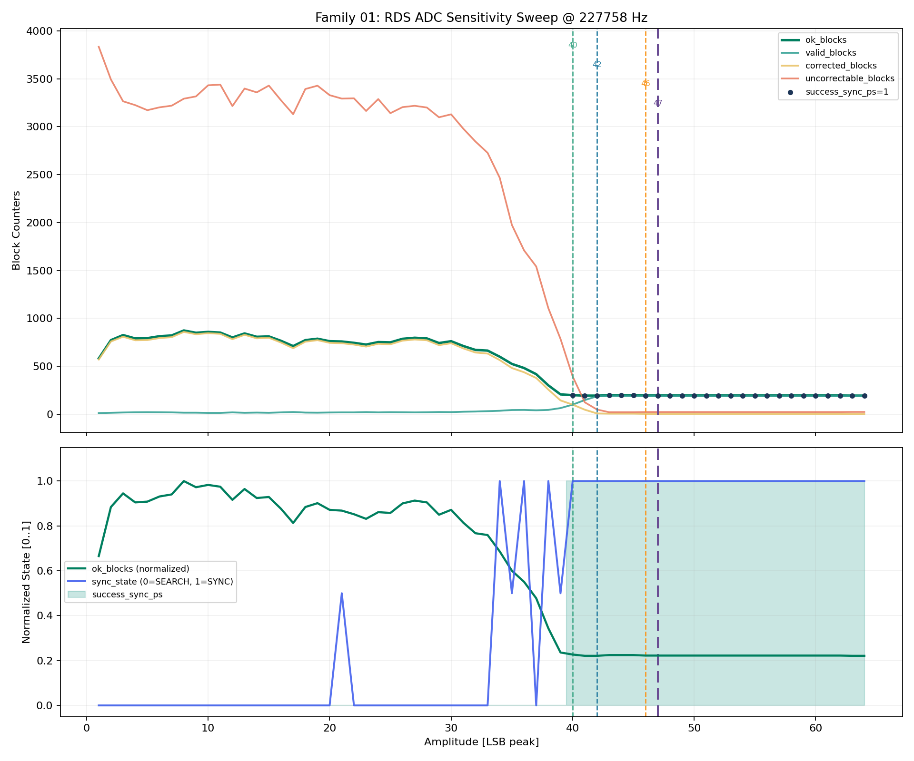

Kryterium PASS:
- `sync_state = SYNC` i poprawny `PS`.

Bieżący wynik:
- rerun wykonany dla `64` poziomów `amplitude_lsb = 1..64`.
   - `25/64` przypadków ma `success_sync_ps = 1`.
   - pierwszy pełny PASS pojawia się przy `amplitude_lsb = 40`.
   - zakres `37..39` jest strefa przejściowa.
      - przy `37` pojawia się już poprawne `PI`, ale bez poprawnego `PS`.
      - przy `38..39` lock i fragmenty `PS` już się zdarzają, ale pełne `TESTFM` wchodzi dopiero od `40`.

Interpretacja:
- próg decode jest ostry i zgodny z celem hardware dla front-endu.
   - od `40` w górę wszystkie testowane poziomy przechodzą.
   - strefa `37..39` pokazuje typowy przebieg dojścia do locku: najpierw `PI`, potem częściowy `PS`, na końcu pełna integralność `8` znaków.

Caveat:
- koniec strumienia daje stały ogon `uncorrectable`.

Wniosek:
- praktyczny minimalny próg syntetycznego baseline to `40 LSB`, a cel PCB v1.1 `45..46 LSB` zostawia sensowny zapas.

Kiedy powtarzać:
- po zmianach w DSP, sync, correction, quality gate, sample-rate handling.

### 02. Margines szumu ADC (`adc_noise_margin`)

Cel testu:
- określić bezpieczny obszar amplituda/szum wokół progu decode.

Bodziec / osie:
- heatmapa `amplitude_lsb x noise_lsb`.

Artefakty:
- [rds_02_adc_noise_margin.csv](../tools/validation_csv/rds_02_adc_noise_margin.csv)
- podgląd PNG:
   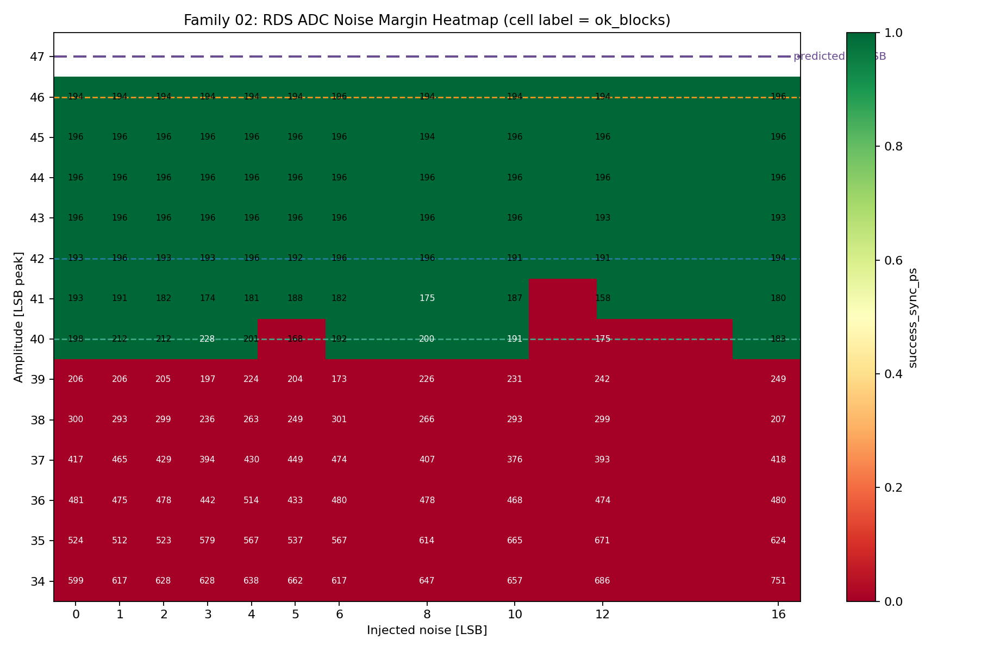

Kryterium PASS:
- poprawny `PS` przy stabilnym `SYNC`.

Bieżący wynik:
- rerun wykonany dla `13` poziomów amplitudy `34..46` i `11` poziomów szumu `0..16`.
   - `72/143` przypadków ma `success_sync_ps = 1`.
   - `34..39` są całkowicie czerwone.
   - `40` przechodzi `7/11`.
   - `41` przechodzi `10/11`.
   - `42..46` przechodzi `11/11` dla całego testowanego zakresu `noise_lsb`.

Interpretacja:
- margines noise ma wyraźny cliff amplitudy, a nie szeroka niepewna strefę.
   - praktyczny safe region zaczyna się od `42 LSB`.
   - `40..41` to strefa graniczna z edge case'ami i lokalna niemonotonicznością, więc nie warto jej traktować jako bezpiecznego obszaru projektowego.

Caveat:
- okolica progu nie musi być idealnie monotoniczna przy skończonej probce.

Wniosek:
- dla baseline i targetu hardware nie warto projektować "na styk"; `42+ LSB` daje pełny margines na testowany noise do `16`, a rekomendowane `45..46 LSB` jest bezpieczne.

Kiedy powtarzać:
- po zmianach w SNR gating, correction, timing, generatorze noise.

### 03. Faza startu i prefix (`phase_prefix_sweep`)

Cel testu:
- zmierzyć wrażliwość na wyrównanie startu i fazę początku strumienia.

Bodziec / osie:
- sweep `prefix_samples` lub bucket fazy startowej, baseline poza tym.

Artefakty:
- [rds_03_phase_prefix_sweep.csv](../tools/validation_csv/rds_03_phase_prefix_sweep.csv)
- podgląd PNG:
   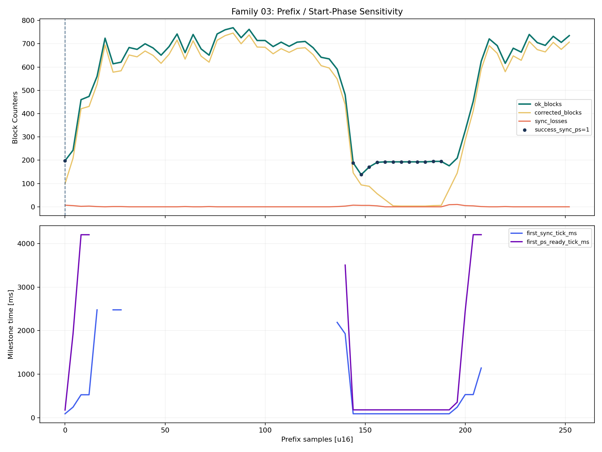

Kryterium PASS:
- brak regresji `time_to_sync` i poprawny `PS`.

Bieżący wynik:
- rerun wykonany dla `64` wartości `prefix_samples = 0..252` co `4`.
   - `13/64` przypadków ma `success_sync_ps = 1`.
   - PASS występuje tylko dla `prefix = 0` oraz dla okna `144..188`.
   - w zielonym oknie milestone są stabilne.
      - `first_sync_tick_ms = 89`.
      - `first_ps_ready_tick_ms = 179`.
      - dla `prefix = 0` `first_ps_ready_tick_ms = 175`.

Interpretacja:
- obecny baseline jest silnie wrażliwy na fazę startu strumienia.
   - to nie jest losowy rozrzut, tylko wąskie i powtarzalne okno fazowe.
   - rodzina dobrze eksponuje zależność od alignmentu początku strumienia i jest dobrym testem regresji timing/prefix path.

Caveat:
- zależy od definicji milestone i chunked decode.

Wniosek:
- rodzina `03` pokazuje, że aktualny tor nie jest fazowo obojętny; prefix alignment jest realnym ograniczeniem i powinien zostać jawnie śledzony po zmianach w timing recovery.

Kiedy powtarzać:
- po zmianach w timing recovery lub granicach symboli.

### 04. Mismatch sample rate (`sample_rate_mismatch_heatmap`)

Cel testu:
- zmierzyć tolerancję na różnicę między sample rate generacji i decode.

Bodziec / osie:
- heatmapa `generate_sample_rate_hz x decode_sample_rate_hz`.

Artefakty:
- [rds_04_sample_rate_mismatch_heatmap.csv](../tools/validation_csv/rds_04_sample_rate_mismatch_heatmap.csv)
- podgląd PNG:
   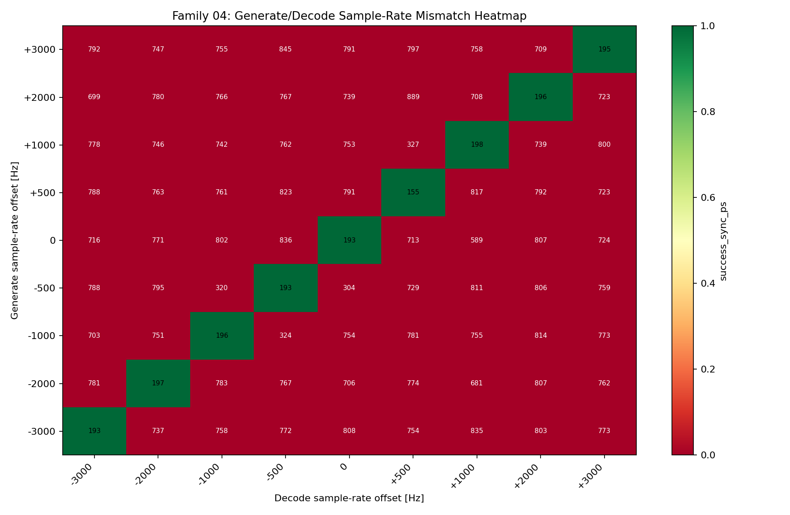

Kryterium PASS:
- brak utraty poprawnego `PI/PS` w oczekiwanym oknie tolerancji.

Bieżący wynik:
- rerun wykonany na siatce `9 x 9` dla offsetów `-3000..3000 Hz`.
   - `9/81` przypadków ma `success_sync_ps = 1`.
   - zielone są wyłącznie pola na przekątnej `generate_offset = decode_offset`.
   - żadna para z `generate_offset != decode_offset` nie przechodzi.
   - na przekątnej milestone pozostają stabilne.
      - `first_sync_tick_ms = 88..177`.
      - `first_ps_ready_tick_ms = 175..264`.

Interpretacja:
- w obecnym harnessie i path sample-rate test mierzy zgodność konfiguracji, a nie szeroka tolerancję na mismatch.
   - tor toleruje różne absolutne sample rate tylko wtedy, gdy generacja i decode są ustawione identycznie.
   - to jest czysta mapa `delta-rate`, nie dowód na adaptacyjną odporność na drift między nadajnikiem i odbiornikiem.

Caveat:
- wymaga oddzielnego rate generacji i decode w runnerze.

Wniosek:
- rodzina `04` potwierdza, że aktualny baseline wymaga zgodnego sample rate po obu stronach; w testowanej siatce każdy `generate != decode` rozwala poprawny `PS`.

Kiedy powtarzać:
- po zmianach w `samples_per_symbol`, NCO i sample-rate handling.

### 05. Offset nośnej i pilota (`carrier_pilot_offset_sweep`)

Cel testu:
- zmierzyć margines błędu dla `57 kHz` i `19 kHz` po stronie generatora.

Bodziec / osie:
- sweep `carrier_hz` i/lub `pilot_hz`, baseline poza tym.

Artefakty:
- [rds_05_carrier_pilot_offset_sweep.csv](../tools/validation_csv/rds_05_carrier_pilot_offset_sweep.csv)
- podgląd PNG:
   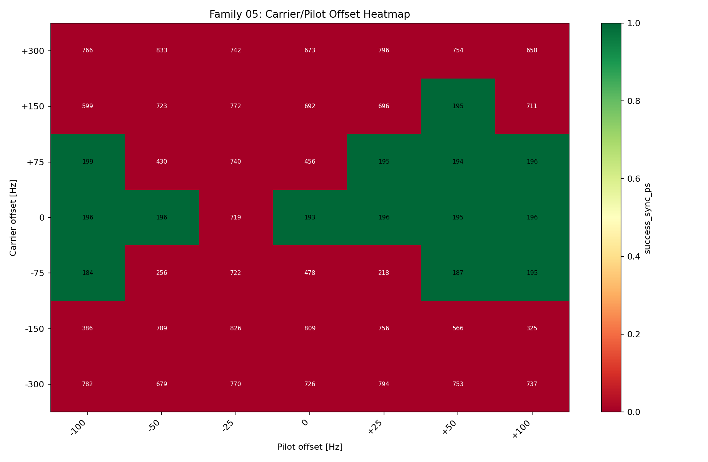

Kryterium PASS:
- brak nadmiernego spadku `lock_quality` i utrzymany poprawny decode.

Bieżący wynik:
- rerun wykonany na siatce `7 x 7` dla `carrier_offset = {-300,-150,-75,0,75,150,300}` i `pilot_offset = {-100,-50,-25,0,25,50,100}`.
   - `14/49` przypadków ma `success_sync_ps = 1`.
   - `carrier = 0` przechodzi `6/7`; jedyny czerwony punkt to `pilot = -25`.
   - `carrier = -75` oraz `75` przechodzą tylko częściowo.
      - `-75` daje `3/7`.
      - `75` daje `4/7`.
   - `carrier = -300` i `300` są całkowicie czerwone.
   - `carrier = -150` jest całkowicie czerwony, a `150` ma tylko pojedynczego survivora przy `pilot = +50`.

Interpretacja:
- tolerancja częstotliwości nie tworzy szerokiego prostokata safe region, tylko wąska i asymetryczna strefę wokół nominalu.
   - tor jest dużo bardziej wrażliwy na offset nośnej niż na sam pilot.
   - ta rodzina jest dobrym detektorem regresji `NCO/pilot path`, ale nie należy jej czytać jako szerokiej gwarancji analogowej poza okolica nominalnych `57/19 kHz`.

Caveat:
- trzeba rozróżnić offset pilota od offsetu samej nośnej RDS.

Wniosek:
- rodzina `05` potwierdza, że nominal `57/19 kHz` ma zapas, ale przy większych carrier offsetach margines szybko się kończy; szczegolnie `|carrier_offset| >= 150 Hz` jest ryzykowne.

Kiedy powtarzać:
- po zmianach w pilot detect, NCO i quality gate.

### 06. Stosunek pilot do RDS (`pilot_to_rds_ratio_sweep`)

Cel testu:
- zmierzyć margines wokół aktualnego quality gate pilot/RDS.

Bodziec / osie:
- sweep `pilot_amplitude` przy stalym `amplitude_lsb`.

Artefakty:
- [rds_06_pilot_to_rds_ratio_sweep.csv](../tools/validation_csv/rds_06_pilot_to_rds_ratio_sweep.csv)
- podgląd PNG:
   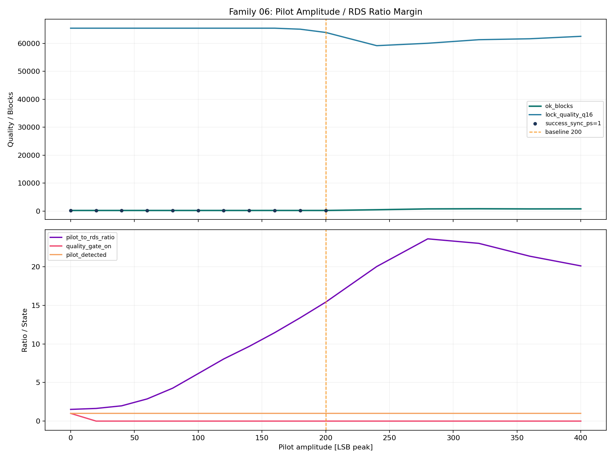

Kryterium PASS:
- stabilny `quality_gate` w oczekiwanym oknie i brak fałszywych dropów.

Bieżący wynik:
- rerun wykonany dla `16` wartości `pilot_amplitude = 0..400`.
   - `11/16` przypadków ma `success_sync_ps = 1`.
   - wszystkie przypadki `pilot_amplitude = 0..200` przechodzą.
   - wszystkie przypadki `240..400` zawodza.
   - stosunek `pilot_to_rds_ratio` w zielonym obszarze rośnie od `1.517` do `15.411`; po wejściu w okolice `20+` robi się czerwono.

Interpretacja:
- quality gate nie jest nadwrażliwy w użytecznym zakresie pilot/RDS.
   - brak flappingu w zakresie `0..200` pokazuje, że aktualny próg nie tnie za wcześnie.
   - cliff pojawia się dopiero przy bardzo dużym pilocie, gdzie tor przestaje składać poprawny `PS` mimo obecnego locku.

Caveat:
- test dotyka jednocześnie metryk DSP i polityki gatingu.

Wniosek:
- rodzina `06` potwierdza szeroki praktyczny safe region dla pilot/RDS; czerwony cliff zaczyna się dopiero powyżej `pilot_amplitude = 200`, czyli przy ratio około `20`.

Kiedy powtarzać:
- po zmianach w `pilot_level`, `rds_band_level` i quality gate.

### 07. Błąd midpoint / DC (`midpoint_offset_sweep`)

Cel testu:
- zmierzyć odporność na błąd midpoint i sztuczny DC offset.

Bodziec / osie:
- sweep midpointu generacji i/lub midpointu dekodera.

Artefakty:
- [rds_07_midpoint_offset_sweep.csv](../tools/validation_csv/rds_07_midpoint_offset_sweep.csv)
- podgląd PNG:
   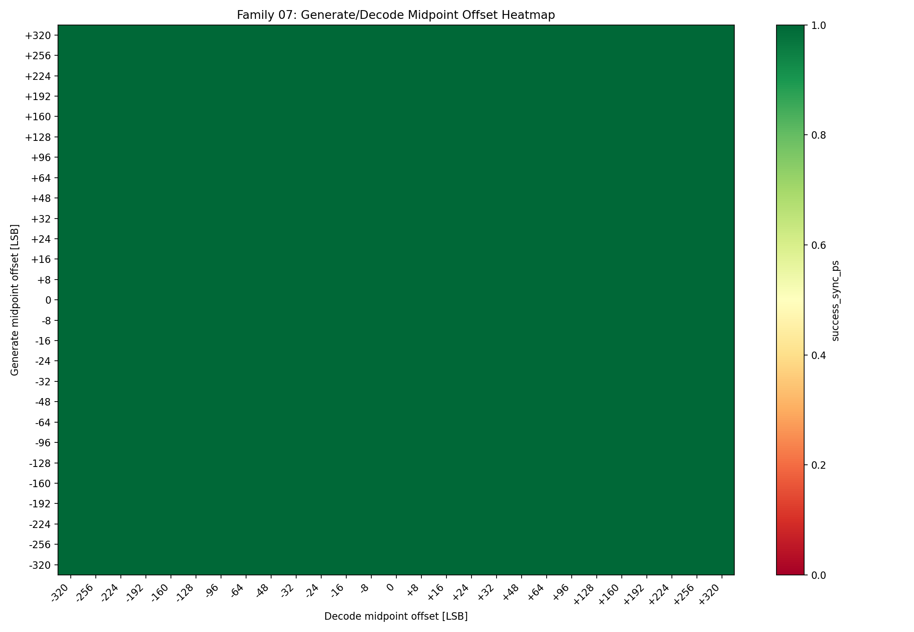

Kryterium PASS:
- brak istotnej utraty decode w oczekiwanym zakresie bledu midpoint.

Bieżący wynik:
- rerun wykonany na siatce `27 x 27`.
   - `729/729` przypadków ma `success_expected_case = 1`.
   - zakres sweepu: `generate_midpoint_offset_lsb = -320..320`, `decode_midpoint_offset_lsb = -320..320`.

Interpretacja:
- w testowanym zakresie nie ma cliffa decode od midpoint/DC.
   - parser utrzymuje sync i poprawny `PS` w całej siatce.
   - ten sweep nie wskazuje na problem w `midpoint handling`; przyszłe czerwienie trzeba łączyć raczej z clippingiem albo fault injection.

Caveat:
- trzeba rozróżnić błąd midpoint od clipowania i od noise.

Wniosek:
- aktualny baseline ma duży margines na błąd midpoint i sztuczny DC offset.

Kiedy powtarzać:
- po zmianach w DC removal i midpoint handling.

### 08. Clipping i saturacja (`clipping_saturation_sweep`)

Cel testu:
- sprawdzić, gdzie zaczyna się regresja decode od kontrolowanego clipowania.

Bodziec / osie:
- sweep `clip_ceiling` lub poziomu przesterowania.

Artefakty:
- [rds_08_clipping_saturation_sweep.csv](../tools/validation_csv/rds_08_clipping_saturation_sweep.csv)
- podgląd PNG:
   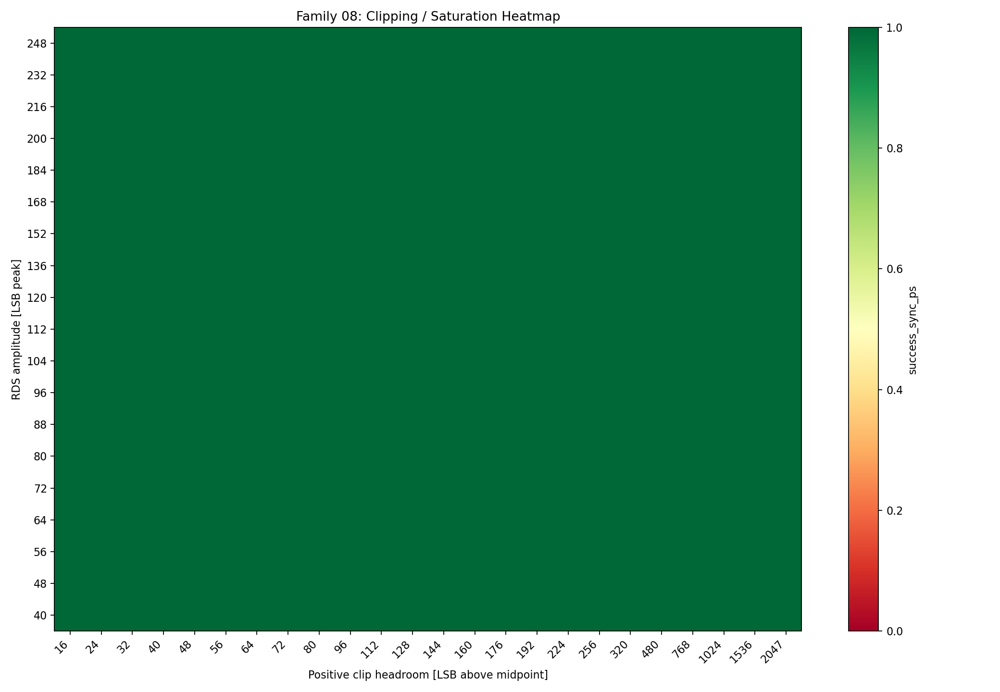

Kryterium PASS:
- wyraźnie zidentyfikowany onset degradacji i brak ukrytego klifu w safe region.

Bieżący wynik:
- rerun wykonany na siatce `19 x 24`.
   - `432/456` przypadków ma `success_expected_case = 1`.
   - wszystkie czerwone pola są skupione wyłącznie przy `amplitude_lsb = 40`.
   - `success_sync_ps = 456/456`, więc sync i `PS` są zachowane nawet w czerwonym pasie.

Interpretacja:
- cliff nie wynika z pojedynczego `clip_headroom`, tylko z samego najniższego poziomu amplitudy.
   - od `amplitude_lsb >= 48` cała badana siatka jest zielona.
   - przy `amplitude_lsb = 40` clipping degraduje kompletność licznikow grup, ale nie zrywa samego locku.

Caveat:
- clip model w generatorze jest uproszczeniem toru analogowego.

Wniosek:
- praktyczny safe region zaczyna się od `amplitude_lsb = 48`; `40` jest obecnym progiem degradacji.

Kiedy powtarzać:
- po zmianach w generatorze amplitudy i przy korektach front-end target.

### 09. Mapa burst errors (`burst_error_map`)

Cel testu:
- zmierzyć praktyczna granice correction i slip-repair dla burst errors.

Bodziec / osie:
- heatmapa `burst_start_bit x burst_len_bits`.

Artefakty:
- [rds_09_burst_error_map.csv](../tools/validation_csv/rds_09_burst_error_map.csv)
- podgląd PNG:
   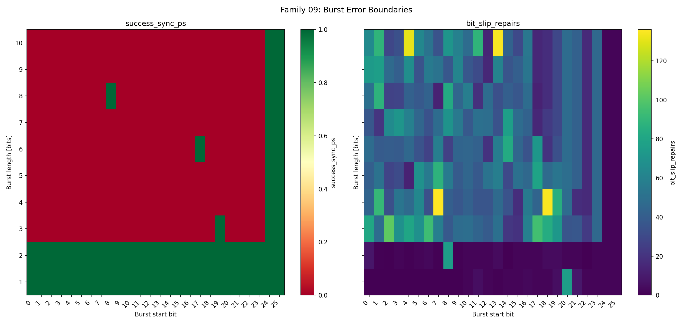

Kryterium PASS:
- zgodność z oczekiwanym limitem correction i czytelny profil fail/pass.

Bieżący wynik:
- rerun wykonany dla `26` offsetów startu i `10` długości burstu.
   - `71/260` przypadków ma `success_expected_case = 1`.
   - burst `1..2` bity przechodzi dla wszystkich offsetów `0..25`.
   - burst `3+` bity przechodzi tylko w wąskich oknach startu, głównie przy końcu bloku.

Interpretacja:
- wynik jest zgodny z aktualna polityka correction `1..2` bity.
   - zielone pola dla `3+` nie podważają tej polityki; są to alignment-specific edge case'y, nie stabilny zapas.
   - mapa dobrze rozdziela "pewna korekcja" od "sporadyczne przetrwanie".

Caveat:
- test jest sztuczny i nie modeluje wszystkich realnych wzorcow bledu.

Wniosek:
- rodzina `09` potwierdza, że obecny limit burst correction powinien pozostać traktowany jako `1..2`, a nie jako gwarancja dla dłuższych burstow.

Kiedy powtarzać:
- po zmianach w correction policy, sync i bit-slip repair.

### 10. Zakłócenia impulsowe i dropout (`impulsive_noise_dropout`)

Cel testu:
- sprawdzić odporność na krótkie destrukcyjne zdarzenia zamiast szumu stacjonarnego.

Bodziec / osie:
- sweep parametrów impulsu i/lub dropoutu.

Artefakty:
- [rds_10_impulsive_noise_dropout.csv](../tools/validation_csv/rds_10_impulsive_noise_dropout.csv)
- podgląd PNG:
   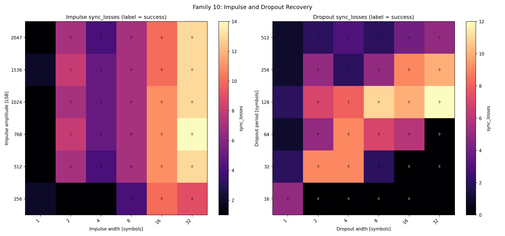

Kryterium PASS:
- kontrolowany wzrost `sync_losses` i zachowany profil recovery.

Bieżący wynik:
- rerun wykonany dla `71` scenariuszy impulsu/dropoutu.
   - `33/71` przypadków ma `success_expected_case = 1`.
   - impulsy: szerokości `1/2/4` są stabilne; `8` zaczyna padać od `amplitude 512`, a `16/32` od `amplitude 256`.
   - dropouty: najbardziej destrukcyjne są gęste okna `period 16..64`; rzadkie i wąskie dropouty pozostają zielone.

Interpretacja:
- ten sweep pokazuje prawdziwy frontier recovery, a nie losowy rozrzut.
   - krótsze impulsy system przeżywa, ale dłuższy impuls szybko niszczy kompletne grupy.
   - przy dropoutach dominuje gęstość zdarzeń; im mniejszy `period`, tym szybciej ginie kompletne składanie.

Caveat:
- definicja impulsy/dropout musi pozostać stała między rerunami.

Wniosek:
- rodzina `10` daje użyteczną mapę awarii dla fault injectorów i jest dobra do porównań po zmianach w recovery.

Kiedy powtarzać:
- po zmianach w fault injectors i recovery semantics.

### 11. Odporność strumienia mieszanego (`mixed_group_robustness`)

Cel testu:
- sprawdzić zachowanie parsera przy mieszanych grupach `0A/2A/2B/other`.

Bodziec / osie:
- sweep harmonogramu i gęstości mieszanych grup.

Artefakty:
- [rds_11_mixed_group_robustness.csv](../tools/validation_csv/rds_11_mixed_group_robustness.csv)
- podgląd PNG:
   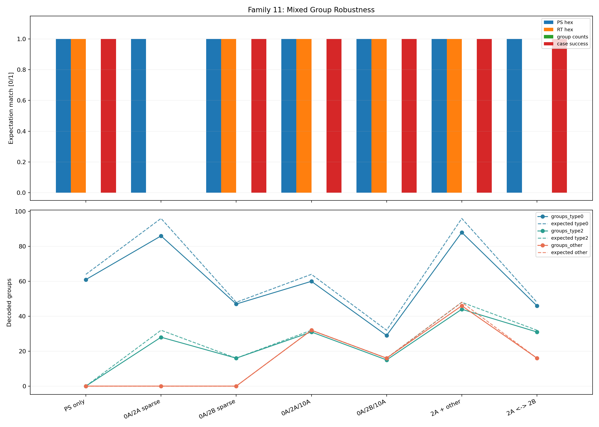

Kryterium PASS:
- poprawne liczniki grup i brak regresji `PS/RT`.

Bieżący wynik:
- rerun wykonany po korekcie harnessu dla rodzin semantycznych.
   - `6/7` przypadków ma `success_expected_case = 1`.
   - `7/7` przypadków ma `success_sync_ps = 1`.
   - czerwony pozostaje tylko przypadek `ps_sparse_2a`.
      - `PS` pozostaje poprawny.
      - `RT 2A` nie osiągnął `rt_ready`; maska zatrzymuje się na `0xFFDF`.

Interpretacja:
- mieszane strumienie `0A/2A/2B/other` są stabilne po stronie `PS` i `RT`.
   - baseline, `2B`, mix z `10A/15B` oraz scenariusz `A/B` nie pokazały regresji podstawowego dekodu.
   - w tej rodzinie nie warto gate'ować PASS przez sztywne absolutne liczniki grup.
      - początkowa akwizycja zjada pierwsze grupy i daje stałe niedoliczenie mimo poprawnej semantyki.
   - otwarty punkt:
      - rzadki harmonogram `2A` nadal nie składa pełnego `64B RT` po locku.
      - to trzeba jeszcze rozstrzygnąć jako bug parsera albo zbyt mały bufor `2A` po `SyncAcquired`.

Caveat:
- zależne od generatora `2A/2B/mixed` i wspólnego schema decode.

Wniosek:
- rodzina `11` potwierdza odporność mieszanych strumieni, ale zostawia otwarty problem dla sparse `2A`.

Kiedy powtarzać:
- po zmianach w group parsing i host generatorze mieszanego strumienia.

### 12. Zbieżność PS i RT (`ps_rt_convergence`)

Cel testu:
- zmierzyć czas i stabilność składania `PS` i `RT`.

Bodziec / osie:
- os czasu/bloków oraz milestone `SyncAcquired`, `PsUpdated`, `RtUpdated`.

Artefakty:
- [rds_12_ps_rt_convergence.csv](../tools/validation_csv/rds_12_ps_rt_convergence.csv)
- podgląd PNG:
   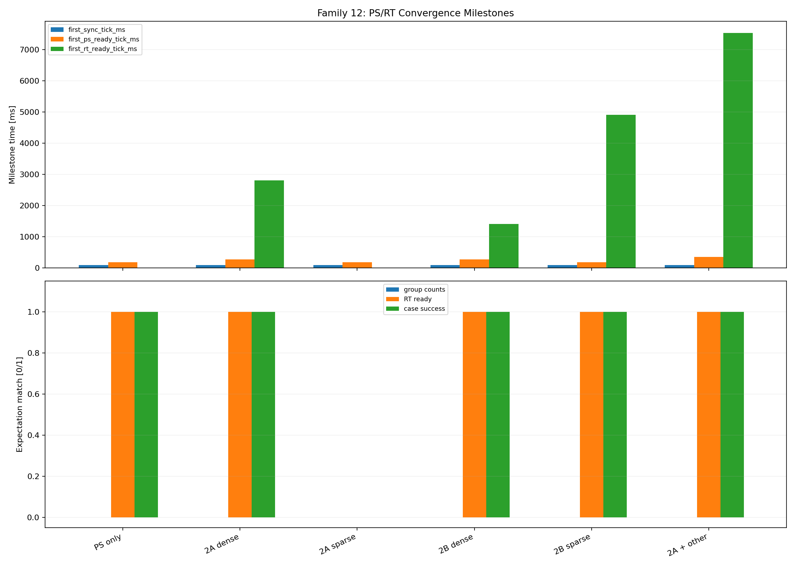

Kryterium PASS:
- przewidywalny `first_sync`, `first_ps_ready`, `first_rt_ready` bez regresji.

Bieżący wynik:
- rerun wykonany po korekcie harnessu i wydłużeniu scenariuszy `2A`.
   - `5/6` przypadków ma `success_expected_case = 1`.
   - `6/6` przypadków ma `success_sync_ps = 1`.
   - milestone'y są stabilne.
      - `first_sync_tick_ms ~= 89`.
      - `first_ps_ready_tick_ms ~= 175..350`.
      - `first_rt_ready_tick_ms` rośnie zgodnie z gęstością strumienia: `1402 ms` dla gęstego `2B`, `2805 ms` dla gęstego `2A`, `4905 ms` dla sparse `2B`, `7535 ms` dla `2A + other`.
   - czerwony pozostaje tylko przypadek `rt_2a_sparse`.
      - `RT 2A` nie osiągnął `rt_ready`.
      - maska zatrzymuje się na `0x7FFF`.

Interpretacja:
- zbieżność `PS` jest szybka i przewidywalna; opóźnienia `RT` rosną tak, jak sugeruje gęstość grup typu `2`.
   - `2B` składa się szybciej niż `2A`, co jest zgodne z mniejszym payloadem.
   - domieszka innych grup przesuwa milestone `RT`, ale nie psuje samego locku.
   - otwarty punkt:
      - sparse `2A` powtarza ten sam wzorzec co rodzina `11`.
      - to wygląda na systematyczną cechę toru `2A`, a nie przypadkowy miss pojedynczego rerunu.

Caveat:
- wymaga chunked decode i wiarygodnego drenowania event queue.

Wniosek:
- rodzina `12` daje wiarygodne milestone'y konwergencji i wzmacnia diagnoze, że problem dotyczy specyficznie sparse `2A`.

Kiedy powtarzać:
- po zmianach w eventach, `PS/RT` parsing i milestone reporting.

### 13. ASCII i interpunkcja (`charset_ascii_punctuation`)

Cel testu:
- sprawdzić integralność zwykłego korpusu ASCII i interpunkcji.

Bodziec / osie:
- corpus byte-by-byte albo case-by-case dla `PS/RT`.

Artefakty:
- [rds_13_charset_ascii_punctuation.csv](../tools/validation_csv/rds_13_charset_ascii_punctuation.csv)
- podgląd PNG:
   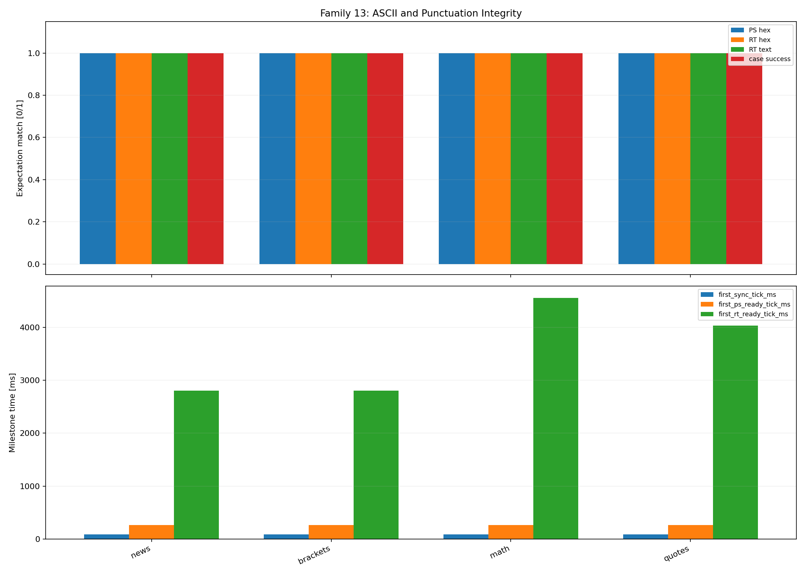

Kryterium PASS:
- zgodność bajtów i brak mylenia integralności z renderowaniem.

Bieżący wynik:
- rerun wykonany po poprawie host decode output i wydłużeniu scenariuszy `2A`.
   - `4/4` przypadków ma `success_expected_case = 1`.
   - `4/4` przypadków ma `success_sync_ps = 1`.

Interpretacja:
- zwykle ASCII i interpunkcja przechodzą end-to-end bez rozjazdu między stringiem i `hex`.
   - escape w host decode output przestał psuc analizę przypadków z interpunkcja.
   - rodzina nadaje się do wykrywania realnych regresji parsera, a nie błędów raportowania.

Caveat:
- klasyczny RDS nie jest `UTF-8`; trzeba patrzeć na bajty i hex.

Wniosek:
- temat ASCII/interpunkcji jest aktualnie domknięty po stronie harnessu i host decode output.

Kiedy powtarzać:
- po zmianach w generatorze tekstu i host decode output.

### 14. Bajty rozszerzone (`charset_extended_bytes`)

Cel testu:
- rozdzielić integralność bajtów rozszerzonych od polityki renderowania tekstu.

Bodziec / osie:
- sweep bajtów rozszerzonych istotnych dla charsetu RDS.

Artefakty:
- [rds_14_charset_extended_bytes.csv](../tools/validation_csv/rds_14_charset_extended_bytes.csv)
- podgląd PNG:
   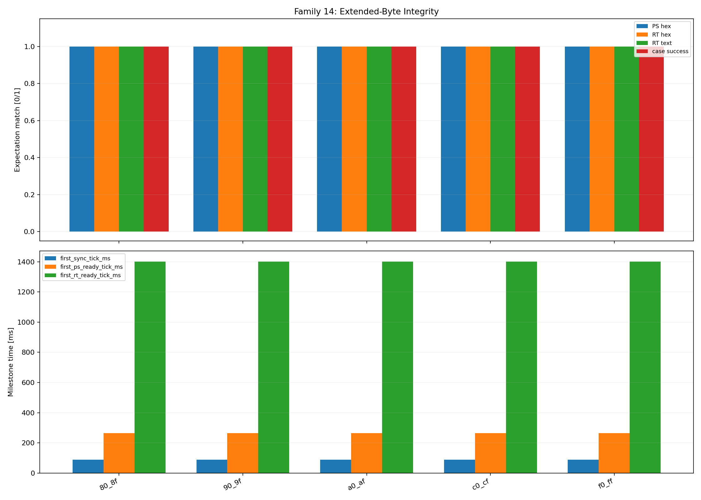

Kryterium PASS:
- zgodność `transmitted byte -> decoded byte`, niezależnie od tego jak jest renderowany znak.

Bieżący wynik:
- rerun wykonany dla `5` case'ów rozszerzonych bajtów.
   - `5/5` przypadków ma `success_expected_case = 1`.
   - `5/5` przypadków ma `success_sync_ps = 1`.

Interpretacja:
- integralność rozszerzonych bajtów jest zachowana, jeśli czytać wynik przez `rt_hex`.
   - polityka renderowania nie zaciemnia już tego testu.
   - ta rodzina dobrze rozdziela "decoded byte" od "widoczny znak".

Caveat:
- wynik trzeba czytać przez `hex`, nie tylko przez widoczny string.

Wniosek:
- rodzina `14` potwierdza poprawny transport bajtów rozszerzonych w aktualnym harnessie.

Kiedy powtarzać:
- po zmianach w rodzinach znakowych i hostowym raportowaniu bajtów.

### 15. End marker i A/B dla RT (`rt_endmarker_ab_reset`)

Cel testu:
- sprawdzić semantykę `0x0D`, flagi `A/B` i resetu cyklu życia `RT`.

Bodziec / osie:
- scenariusze z end markerem, partial RT i kontrolowanym flipem `A/B`.

Artefakty:
- [rds_15_rt_endmarker_ab_reset.csv](../tools/validation_csv/rds_15_rt_endmarker_ab_reset.csv)
- podgląd PNG:
   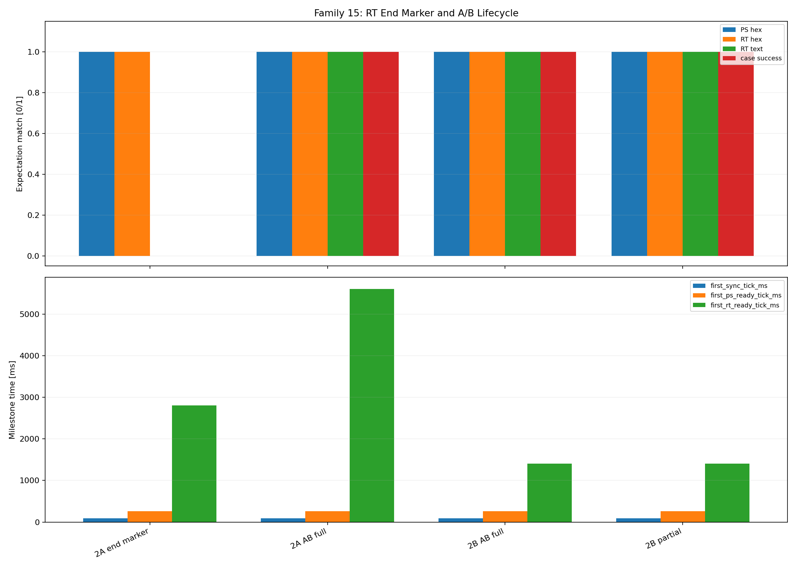

Kryterium PASS:
- poprawny reset `RT`, poprawny milestone i brak mieszania starego tekstu z nowym.

Bieżący wynik:
- rerun wykonany dla `4` scenariuszy cyklu życia `RT`.
   - `3/4` przypadków ma `success_expected_case = 1`.
   - `4/4` przypadków ma `success_sync_ps = 1`.
   - oba scenariusze `A/B full` są zielone.
      - `2A AB full` przechodzi.
      - `2B AB full` przechodzi.
   - `2B partial` przechodzi zgodnie z oczekiwaniem braku gotowego nowego `RT`.
   - czerwony pozostaje tylko `endmarker_primary_2a`.
      - zwracany tekst to `LIVE\x0DSTALE TAIL`.
      - oczekiwana semantyka to obcięcie do `LIVE`.

Interpretacja:
- flip `A/B` i reset cyklu życia `RT` działają poprawnie w pełnych scenariuszach.
   - problem nie leży w samym `A/B`.
   - otwarty punkt:
      - aktualny `RDSCore` nie honoruje `0x0D` jako end marker `RT`.
      - to jest realny brak semantyki parsera, nie fałszywe czerwone od harnessu.

Caveat:
- wymaga jednocześnie generatora `2A/2B`, `A/B` flip i milestone output po stronie decode.

Wniosek:
- rodzina `15` zawęziła problem do obsługi `0x0D`; logika `A/B` jest potwierdzona.

Kiedy powtarzać:
- po zmianach w `RT` parsing, `A/B`, end-marker handling i eventach tekstowych.

---

## Główne wnioski z kampanii 01-15

Wnioski ogólne:
- rodziny `01..02` ustaliły praktyczny baseline analogowy.
   - pierwszy pełny PASS jest od `40 LSB`.
   - pełny safe region dla testowanego noise zaczyna się od `42 LSB`.
   - dlatego nominalny cel hardware `45..46 LSB` jest nadal poprawny i daje sensowny zapas.
- rodziny `03..06` pokazały, że tor jest wrażliwy na alignment i zgodność konfiguracji.
   - `03` ma wąskie okno fazowe dla `prefix`.
   - `04` przechodzi tylko na przekątnej `generate_rate = decode_rate`.
   - `05` ma wąska i asymetryczna strefę sukcesu wokół nominalnych `57/19 kHz`.
   - `06` jest stabilne w szerokim zakresie pilot/RDS i dopiero przy bardzo dużym pilocie wpada w czerwony cliff.
- rodziny `07..10` i `13..14` domknęły szeroki baseline toru.
   - `07` nie pokazuje problemu midpoint/DC w badanej siatce.
   - `08` zawęża clipping cliff do `amplitude_lsb = 40`.
   - `09` potwierdza praktyczny limit correction `1..2` bity.
   - `10` daje czytelną mapę awarii dla impulsów i dropoutów.
   - `13..14` potwierdzają, że ASCII, interpunkcja i bajty rozszerzone są poprawnie transportowane i raportowane.

Najważniejszy wniosek diagnostyczny:
- po odfiltrowaniu problemów harnessu i po rozszerzeniu rerunów czerwone przypadki zostały zawężone do dwóch konkretnych tematów parsera, a nie do ogólnej niestabilności DSP/core.
   - `15` izoluje brak semantyki `0x0D`.
      - jedyny czerwony case to `endmarker_primary_2a`.
      - oba scenariusze `A/B full` są zielone, a `2B partial` też przechodzi.
      - to znaczy, że problem nie leży w samym `A/B`, tylko w tym, że parser nie ucina `RT` na `0x0D` i zwraca `LIVE\x0DSTALE TAIL` zamiast `LIVE`.
   - `11..12` izoluje problem sparse `2A`.
      - po wydłużeniu scenariuszy i korekcie harnessu dalej czerwone zostają tylko `ps_sparse_2a` i `rt_2a_sparse`.
      - `PS`, sync, `2B` i pozostałe mixy są zielone.
      - maski zatrzymują się o jeden segment przed pełnym domknięciem (`0xFFDF` i `0x7FFF`), więc to wygląda na systematyczny problem ścieżki `2A`, a nie losowy miss pojedynczego rerunu.

Wnioski operacyjne wynikające z pomiarów:
- Mogę teraz naprawić semantykę `0x0D` w `RDSCore.c:384`.
- Mogę przejść do diagnozy, dlaczego rzadki `2A` gubi pełne domknięcie maski segmentów.

---

## Testy syntetyczne czułości ADC (legacy wyniki rodzin 01 i 02)

Ta sekcja pozostaje tymczasowo jako materiał wynikowy dla rodzin `01` i `02`.
Po kolejnej aktualizacji wyników jej liczby zostaną utrzymywane już bezpośrednio
w odpowiadających im podsekcjach metodologii powyżej.

### Użyte narzędzia

Pliki i binarki:
- `tools/bin/rds_raw_generate`
- `tools/bin/rds_raw_decode`
- `tools/bin/rds_dsp_selftest`
- `tools/bin/rds_bit_compare`
- `tools/bin/rds_core_selftest`

Wspierające pliki wynikowe:
- [rds_01_adc_sensitivity_sweep.csv](../tools/validation_csv/rds_01_adc_sensitivity_sweep.csv)
- [rds_02_adc_noise_margin.csv](../tools/validation_csv/rds_02_adc_noise_margin.csv)
- [rds_01_adc_sensitivity_sweep.png](../image/rds_01_adc_sensitivity_sweep.png)
- [rds_02_adc_noise_margin.png](../image/rds_02_adc_noise_margin.png)

### Metoda testu

Test syntetyczny został wygenerowany dla **realnego** sample rate firmware:
- `sample_rate_hz = 227758`
- `adc_midpoint = 2048`
- `pilot_amplitude = 200 LSB`
- `PS = TESTFM`
- `PI = 0xCAFE`
- `repeat_count = 12`
- `pulse_duty_pct = 100`

Generator:
- tworzy poprawny bitstream RDS,
- moduluje go na `57 kHz`,
- dokłada pilot `19 kHz`,
- opcjonalnie dokłada deterministyczny pseudo-gaussian `noise_lsb`.

Decoder hostowy:
- używa tego samego `RDSDsp` i `RDSCore`,
- czyli sprawdzamy prawdziwy kod, nie model zastępczy.

### Wyniki najważniejsze

Z [rds_01_adc_sensitivity_sweep.csv](../tools/validation_csv/rds_01_adc_sensitivity_sweep.csv):
- pierwszy pełny sukces (`sync_state=SYNC` i `PS == TESTFM`) pojawia się przy:
  - `40 LSB peak`
  - `32.234432 mV peak`
- ostatni punkt bez pełnego sukcesu:
  - `39 LSB peak`
  - `31.428571 mV peak`


Z [rds_02_adc_noise_margin.csv](../tools/validation_csv/rds_02_adc_noise_margin.csv):
- `40 LSB` jest progiem granicznym: część poziomów szumu przechodzi, część nie,
- `42 LSB` przechodzi dla całej testowanej macierzy `noise_lsb = 0..16`,
- `46 LSB` ma już wyraźny zapas i przechodzi wszystkie testowane punkty.


### Bardzo ważna obserwacja praktyczna

Próg stabilny z testu syntetycznego:
- `42 LSB peak`
- `33.846154 mV peak`

To daje bardzo ważny wniosek projektowy:
- stare założenie `~41 LSB` dla toru `MCP6001` jest już za blisko granicy poprawnego działania,
- skoro `42 LSB` jest stabilnym progiem, a `46 LSB` daje wyraźny zapas,
  to nominal dla PCB v1.1 powinien trafić bliżej `45..46 LSB`.

Rekomendowany update gain dla PCB v1.1:
- zostawić `Rg = 2 kOhm`,
- z dostępnych wartości PCBA wybrać `Rf = 12 kOhm`,
- co daje `Av = 7.0x`,
- i przewidywany poziom na ADC około `47 LSB peak`.

Czyli:
- syntetyka pokazała, że front-end trzeba delikatnie podbić względem starego celu,
- ale nie ma potrzeby iść w agresywne `7.7x`,
- z ograniczonej biblioteki PCBA najlepszy wybór to `12k / 2k`,
  bo `12k / 2.2k` wychodzi już zbyt nisko, a `10k / 1.5k` zbyt wysoko.

### Uwaga o interpretacji CSV

1. W syntetyce nawet przy bardzo dobrym sygnale widać stały ogon `uncorrectable_blocks`.
   To nie jest prawdziwy "BER floor" nadajnika, tylko artefakt końca strumienia i sposobu,
   w jaki hostowy harness kończy próbę.

2. W okolicy progu wynik noise sweep nie jest idealnie monotoniczny.
   To nie przeczy fizyce.
   Powód:
   - szum jest deterministyczny, ale generowany dla różnych `sigma`,
   - długość próbki jest skończona,
   - sam próg sync zależy od sekwencji błędów, nie tylko od średniej amplitudy.

3. Dlatego w praktyce trzeba patrzeć na dwa progi:
   - **próg minimalny**: `40 LSB`,
   - **próg bezpieczny / stabilny**: `42 LSB`.

### Co mówią testy o ADC Flippera

Wniosek roboczy:
- przy realnym firmware sample rate `227758 Hz` dekoder potrzebuje około `32..34 mV peak` na ADC,
  żeby wejść w stabilny obszar poprawnego dekodowania `PS`,
- to znaczy, że sama cyfrowa część jest już wystarczająco dobra,
- i główna praca do wykonania jest po stronie hardware MPX front-end.

---

## Rozjazdy względem starego planu i SAA6588

### Rzeczy poprawione względem starego planu

- `sample_rate` realny to `227758`, nie idealne `228000`
- ~~realny hardware używa `generic NCO path`, nie `fast path 228k`~~ → **naprawione**: fast-path kod **usunięty**, jedyna ścieżka to `NCO`
- correction table jest `1..2`, nie `1..5`
- wejście z `SEARCH` do `PRE_SYNC` akceptuje tylko `Valid` / exact match; `Corrected` w `SEARCH` pozostają diagnostyczne
- ~~quality gate dla `rds_band` ma próg `1024 Q8`, nie `5120 Q8`~~ → **naprawione**: teraz `5120 Q8` = `20.0`
- ~~`2B` ma `16` segmentów po `2` znaki, nie `8`~~ → **naprawione**: teraz `8` segmentów po `2` znaki
- event queue dropuje **najstarszy** event, nie newest
- ~~`BlockStatsUpdated` jest zdefiniowany, ale nie jest emitowany~~ → **naprawione**: emitowany co `32` bloki
- ~~`tick_ms` w eventach istnieje, ale nie jest wypełniany~~ → **naprawione**: wypełniany przez `rds_core_set_tick_ms()`
- `slip_retry_pending` istnieje, ale obecnie nie uczestniczy w realnym retry
- aktualne pliki runtime to `rds_runtime_meta.txt` / `rds_capture_u16le.raw` / `rds_capture_meta.txt`,
  a nie `session_meta` / `mpx_adc_u16le`

### Co zostało wzięte z SAA6588 tylko koncepcyjnie

1. Wydzielenie toru `57 kHz`
2. Praca na regenerowanej nośnej / ekwiwalencie nośnej
3. Integracja symboli i dekodowanie różnicowe
4. Syndrome-based block detection
5. Correction na poziomie bloku
6. Sync po sekwencji bloków
7. Flywheel jako tolerancja na chwilowe błędy

### Czego nie kopiujemy z SAA6588 1:1

- analogowego switched-cap filter,
- dedykowanego jednoukładowego demodulatora,
- analogowego comparatora,
- rejestrowego interfejsu `SAA6588`,
- `presync=2`,
- sprzętowej implementacji wszystkiego w jednym ASIC.

Czyli finalnie:
- `SAA6588` jest dla nas wzorcem architektury,
- ale Flipper ma logicznie przejąć jego rolę przez `ADC + DMA + DSP + CPU`.

---

## Wymagania PCB v1.1

Na PCB v1.1 powinno zostać zachowane:
- połączenie `MPXO` z `TEA5767 pin 25` do front-endu `MCP6001`
- wyjście `MCP6001` do `PA4`
- zasilanie `MCP6001` z `3.3V_TEA`
- nominalny gain front-endu ustawiony na około `7.0x`
   (`Rf = 12 kOhm`, `Rg = 2 kOhm`)
- bardzo krótka trasa analogowa do `PA4`
- brak prowadzenia tej linii obok wyjść głośnikowych i sekcji PAM

Szczegóły hardware:
- [pcb_v1_1_design_notes.md](pcb_v1_1_design_notes.md)

---

## Historia i uwagi końcowe

Ten dokument był pierwotnie planem implementacji.

Aktualna wersja jest już mapą rzeczywistego kodu i rzeczywistych danych:
- `RDSAcquisition`, `RDSDsp`, `RDSCore`, `radio.c`
- aktualne runtime files
- syntetyczne CSV dla `227758 Hz`

Główny wniosek po aktualizacji dokumentu:
- software dekodera jest już na poziomie, który warto dalej stroić,
- ale prawdziwa granica projektu leży teraz w analogowym SNR,
- dlatego następny twardy etap walidacji to nie kolejny rewrite state machine,
  tylko potwierdzenie toru `MCP6001 + PCB v1.1`.
